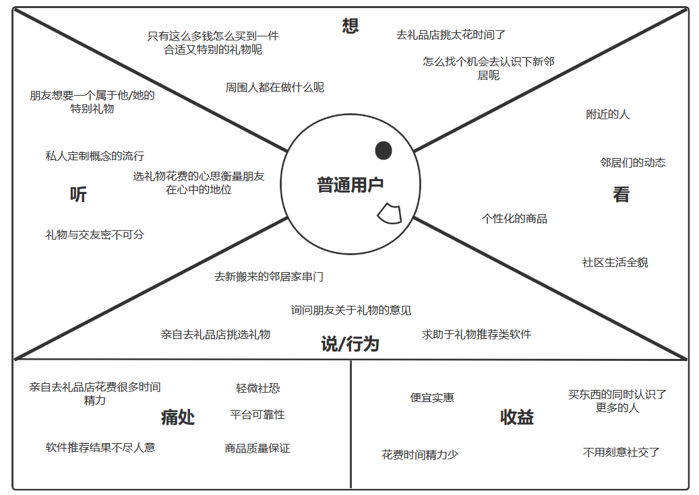
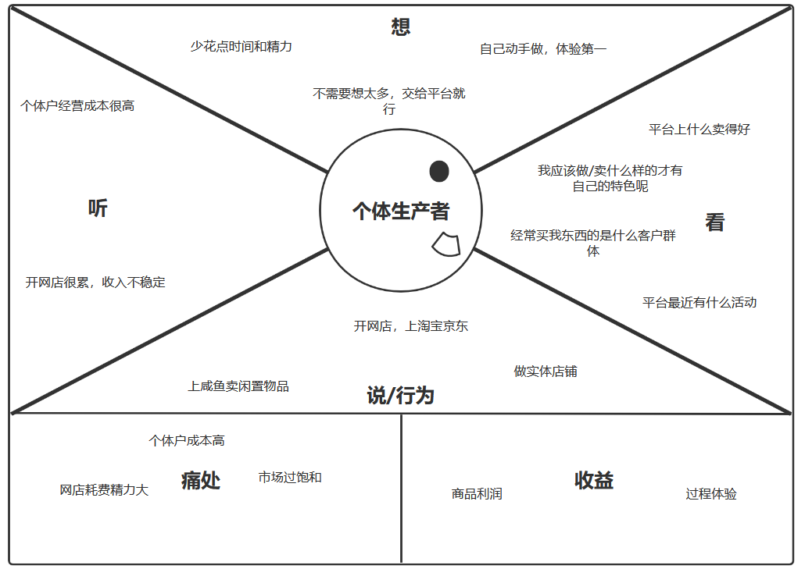
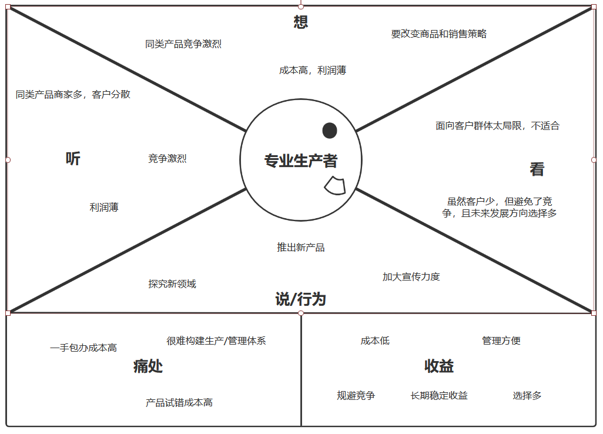

# 零居里商业模式设计文档

## 1. 度量数值

## 2. 客户洞察  

### 2.1 普通用户

- **看：**
零居里平台展示给普通客户主要是社交和日常购物。用户在平台上发现生活在附近但是素未谋面的邻居们，而通过独特的类似于自产自销的方式，用户也能了解整个社群中周边人的生活。同类的基于购物的社交平台软件产品通常会将购物，物流，社区剥离(独立)，使得它们之间的关系不是非常紧密，用户使用这类产品会遇到这样几个问题：需要较长时间对整个购物环境进行了解，真实物品和展示的一致性问题，购买者与推荐者之间的联系薄弱，需要另外寻找电商平台进行购买(平台本身不提供)。
- **听：**
随着私人定制这类概念的兴起，相比于传统礼物，一些特殊的别出心裁的小玩意更受青睐。礼物的别致与否一定程度衡量着送礼人在挑选时花费的心思，受礼人在送礼人心目中的位置等等。而考虑到质量监管，定价等问题，大规模的电商平台并不能很好的将这类商品纳入其中。另外，礼物与交友是密不可分的，在实现礼物定制化的同时推动社交的进行将会成为一个热门话题。
- **想：**
如何花费有限的成本淘到自己想要的东西，如何找到一件别出心裁的礼物，如何了解周围的人平时都做些什么，如何不突兀地认识附近的人。
- **说和做：**
去询问朋友关于礼物的意见，使用一些礼物推荐软件，去礼品店里挑选，通过社交软件结识附近的人，串门。
- **痛处：**
来自第三方的意见不够个性化，亲力亲为需要耗费大量时间，需要克服面对面社交的恐惧感与羞怯感，对商品质量的担忧。
- **收益：**
便宜的价格，个性化的商品，投入更少的时间精力，在购物的同时能够认识更多的人，自然的社交方式。

### 2.2 个体生产者

- **看：**
对于个体生产者，他们通过零居里这个平台以零散的时间，有限可调整的资源来获得金钱收益和社交关系。在平台上他们主要关注商品，客户群体和平台活动。通过分析商品出售的情况可以看出什么类型的商品比较受欢迎，以此为根据调整自己出售的商品。通过查看交易记录获取客户群体，从而调整商品的整体风格和定位。通过关注平台活动在短期内获得比较好的销售情况。
- **听：**
个体户独立经营成本高，成功概率低；网店花费精力大收入不稳定。
- **想：**
花费少量的时间精力；自己动手DIY，金钱其次，体验第一；不需要考虑交易过程，全程依托于平台。
- **说和做：**
个体生产者往往转向淘宝京东等大型电商平台，如果利润符合期望的话，很大一部分人会转为全职；少数人也会选择白手起家，后期逐渐扩大规模；此外还有基于平台(咸鱼网)的物品交易。
- **痛处：**
无论是传统电商或者实体，个体生产者都要付出相对较大的成本，并且花费精力较多；并且由于这方面的市场已经非常成熟稳定，个体生产者很难获得满意的收益。
- **收益：**
商品销售获得的利润，手工生产/线下对接的体验。

### 2.3 专业生产者
- **看：**
专业生产者寻找的是一个信誉过硬，面向大众市场有广阔客户渠道的电商平台，他们对零居里这个平台会有两种看法：一是零居里并非一个传统的直接面向大众的平台，它是面向社区的，
并不具备传统意义上符合条件的客户渠道；但另一方面，由于成熟的电商平台上同类商品竞争过于激烈，专业生产者刚加入传统的电商平台时很难获得客户的关注和信任，这会使得起步阶段较为艰难，
而由于零居里面向社区，缩小客户群体的同时也保证了同类商品不会过饱和，以社区的稳定保证市场的稳定，能够同时做到平稳起步和长期发展。
在积攒了一定的人气之后转向更为专业的电商平台也是一种选择。
- **听：**
同行说这一行做久利润越来越薄，商家多，客户也被分散了。
- **想：**
成熟的产业做的人很多，只会被逐渐淘汰，要另辟蹊径，既要在商品本身上做文章，也要在销售方式上推陈出新。
- **说和做：**
探究新领域，尝试新产品，加大宣传力度吸引新客户。
- **痛处：**
制造，宣传，销售全都自己做成本高，构建规模化的生产流水线和完善的管理体系需要大量人力财力，产品试错成本高，创新有很大几率不能迎合市场需求。
- **收益：**
规避过度竞争，低经营成本，低试错成本，管理方便，选择多样，长期稳定收益。

## 3.构思
### 3.1 基本商业构思

根据以上的客户洞察，我们认为可以搭建一个社区性的平台，通过平台的联系，可以满足社区社交，电子购物，自制小品贩卖等需求。零居里通过与第三方品牌，社区，商贩结合，以低价格、低成本、创新性社区交流平台的价值主张来满足上述群体的需求。

### 3.2 候选商业模式创意
#### 3.2.1 创意一
资源驱动：通过和第三方品牌的合作，在“引进来”的同时实现“走出去”的目标，扩展社区封闭的生态，让商品面向更加广大的客户群体。  
如果缺少有力的第三方合作者呢？  

+ 考虑到社区发展的前期，可能这种商业模式还并不为人所熟知，需要花费一部分成本引进品牌，并且展示社区自身的发展潜力，吸引第三方合作。
+ 与优质的第三方品牌构建长期合作关系，社区向品牌输送创意和成品，品牌进行包装宣传并让利于社区。
+ 社区会为第三方品牌做一定的宣传工作以保证合作关系的稳固。  

对整个商业模式画布的影响：

+ 会对可变成本造成一定程度影响。
+ 在合作关系稳定后，未来收入会得到相应提升。
#### 3.2.2 创意二
用户驱动：社区整体自下而上构建，用户约束少，社区走向由用户自身控制和决定。  
如果用户活跃度不够呢？

+ 在软件推出的初期，需要社区加大宣传力度，提高软件普及率。

+ 在软件使用经过一段时期后，既有用户会通过推荐，邀请等方式带动更多新用户加入。

+ 社区推出定期活动吸引用户。

+ 社区将日常事务和软件进行绑定。  

对整个商业模式画布的影响：

+ 控制权交予用户，加强客户关系。

+ 减少社区管理的成本，社区发展模式更加自由。
#### 3.2.3 创意三

创新驱动：为用户提供一种新颖、便捷的电子购物方式

如果应用提供的电子购物方式足够便捷会怎样？

+ 形成良好且有卖点的价值主张，能吸引更多潜在的客户
+ 引入众多客户后，需要大量的人力资源和服务器资源，会增加一定的成本

对商业模式画布的影响：

+ 增加了运维成本，但与此同时利润也增加了
+ 让核心资源进一步得到推广和放大
+ 使得与实体商贩的合作更加紧密，增加额外业务

#### 3.2.4 创意四

客户驱动，财务驱动：用成本较低的办法吸引吸引足够多的用户，以创造更多的收入。

如果平台的社区交流氛围不足会怎么样？

+ 先把重心放在平台自有产品宣传，吸引足够多的使用用户后，再通过优惠等激励措施引导用户参与社区的建设。

+ 加大宣传，请优质的第三方品牌协助宣传，社区向品牌输送创意和成品，品牌进行包装宣传并让利于社区。

对商业模式画布的影响：

+ 平台发展过程中的成本结构与收入来源的各成分比重会随时间变化，前期需要花费一些额外费用(宣传等) 来帮助建立社区氛围，社区足够大后，相关的收入 (问答费用抽成) 才足够显著。

+ 平台的社区价值主张在前期主要依靠平台自身进行宣传和推广，有足够大的用户群体后才能自发地维护和建设社区氛围。

#### 3.2.5 创意五

财务驱动：生产者与消费者直接议价，平台不做多余收付费

如果生产者和消费者议价过程中出现不和怎么办？

+ 平台有专业的评估人员进行价格评估，但是最终决定权仍在消费者和生产者手中。

对商业模式画布的影响：

+ 影响了收益模式的设置，增生了会员服务。

### 3.3 最终确定的商业模式创意

## 4.视觉化思考
### 4.1 可视化画布

### 4.2 相关分析

## 5.模型构建

经过对商业模式画布的精细化和补充，我们最终建立了一个商业模型。

### 5.1 商业模式画布

### 5.2 商业画布要点

#### 5.2.1 关键业务

a. 平台搭建：提供多样且高质量的推文和产品介绍，为帮助用户了解多样化的产品，并通过产品接触和熟悉店家，促成一个交流平台

b. 社区交流：用户分享生活，产品，用过产品后的感受等，带动更多的流量

c. 会员服务：平台对会员提供额外的增值服务

d. 电子购物：用户通过平台展示并交易商品

#### 5.2.2 价值主张

a. 创新社区交流平台：现有的种草、网购平台，在用户搜寻到商品与商家交流时，往往会有中间商进行差价收取，或由于平台抬价而导致交易障碍。本平台提供的服务就是交易完全由客户与商户之间进行，以社区为单位负责商品宣传、牵线搭桥和售后保障的任务，是一次创新的尝试。

b. 定制与保姆式服务：对于销售记录良好的会员用户，本平台会提供特别的一站式服务，包括商品宣传、物流运输等方面。

c. 低价格：普通用户通过了实名认证就可以出售自己的非二手货物，会员用户只需提交月费便可获得高质量宣传、便捷的物流等服务。

d. 低成本：平台放手交易流程使得客户和商户之间可以节省中间商的赚取金额，同时节约了用户的时间，使得用户可以做更多有价值的事情。

#### 5.2.3 客户关系

a. 社区：社区传播是平台获取客户的主要途径，平台用户与生产者都从社区中诞生。

b. 共同创作：我们为希望扩大规模的优秀商户提供个性化的帮助。

c. 用户间合作：鼓励一定区域内的商户合作（包括共享生产基建，避免恶性价格战等），帮助其降低成本并保持对平台的粘性。

#### 5.2.4 重要合作

a. 社区合作：与社区合作，平台提供了一个多元化的社区交流环境。用户可以通过社区关系了解平台的业务和功能，同时平台让社区交流更加活跃

b. 商家合作：和社区中的小型商贩合作，提供了一个更加便利的交流平台

c. 品牌合作：引入第三方品牌，提供更优渠道；打造平台自身品牌，推广提升平台质量

#### 5.2.5 收入来源

a. 会员费：平台提供额外的收费服务，只对会员开放，如额外的交易次数，定制推送等；对非会员提供基本的服务

b. 增值服务收费：平台有偿为需要的客户提供广告设计，商业包装，产品促销等服务

c. 品牌合作费：平台筛选高品质的商品打造成自身的品牌，进行推广；并会定时外包给第三方品牌，利用平台的社区资源开展促销宣传活动

#### 5.2.6 核心资源

a. 实物资源：所拥有的实物资源主要是为了支持系统的在线平台，因此需要能够提供各种应用的服务器。

b. 人力资源： 包括开发人员和核心的用户。平台的开发团队、和用户的交流人员、各种服务的组织人员等都是重要的人力资源。

c. 知识性资源：主要由用户生产的资料组成。包括用户发布的推文，视频，图片等，这些共同组成了平台的知识性资源。

#### 5.2.7 成本结构

a. 固定成本：包括开发软件的成本，购买和维护物理服务器的成本，雇佣工作人员的成本等;因为无论平台是否正常运行，是否盈利都会包含这些费用，所以归为固定成本

b. 可变成本：雇佣维护人员/客服人员的成本，平台推广宣传的费用，定期举办活动的成本，和第三方合作的成本；因为这些活动是否会发生或者进行由平台发展情况和近期事件决定的，不能事先确定，所以归为可变成本

#### 5.2.8 渠道通路

a. 合作方渠道：与社区、村镇的合作与宣传，与已有项目的合作与宣传，可以迅速提升普及度。同时，高品质的个体商户可以提供优质的产品，获得优秀的业绩，平台也会额外提供优质的保障服务，与此同时，社区、乡镇举办的商品交流活动也可以进一步提升评价。

b. 自有渠道：平台内部提供专业的宣发、物流人员，对会员用户提供帮助，同时通过健全的安全保障机制、信用机制进行售后服务保障，

#### 5.2.9 客户细分

a. 普通用户：平台为各社区中的普通用户提供信息，便于用户获取附近易得的各类服务，用户提供的流量成为平台的运营基础。

b. 个体生产者：平台为有生产能力的个体生产者提供宣传，其是平台实际上的内容提供者。

c. 专业生产者：平台对社区内评价优异的个体生产者进行考察，并在其有意愿的前提下签约并利用平台资源辅助其扩大生产规模并分享收益。

### 5.3 要点联系

##### 1a（平台搭建），5c（品牌合作费）

平台提供将高品质的商品打造成自身的品牌并进行推广的服务，由此收取一定的费用

##### 1a（平台搭建），4a（社区合作）

社区管理人员合作，打造社区化的平台

##### 1b（社区搭建），2d（低成本）

搭建社区式的小型交流平台，促进社区居民的交流

##### 1c（会员服务），5a（会员费），5b（增值服务收费）

平台可对有需求的客户提供有偿的广告设计，商业包装，产品促销等服务

##### 1d（电子购物），2a（创新社区交流平台）

平台为用户提供了创新社区交流平台这一价值主张，各自经济业务可由电子购物实现

##### 2b（定制与保姆式服务），6a（实物资源），6b（人力资源）

需要网站式平台来提供服务，同时需要一定的人力来解决某些问题

##### 2b（定制与保姆式服务），7a（固定成本），7b（可变成本）

提供服务需要网站，而搭建和维护网站需要相关的人力成本和服务器成本

##### 2b（定制与保姆式服务），8b（自由渠道）

通过人性化的服务吸引用户

##### 4b（商家合作），4c（品牌合作），5b（增值服务收费），5c（品牌合作费）

根据相关合作获得一定的收益

##### 5b（增值服务收费），9b（个体生产者），9c（专业生产者）

为特殊客户群体提供额外的增值服务收取费用

##### 6a（实物资源），7a（固定成本）

服务器平台属于要支付的固定成本

##### 6b（人力资源），7b（可变成本）

平台的开发团队、和用户的交流人员、各种服务的组织人员需要根据不同的水平支付不同的薪酬，属于可变成本

##### 2b（定制与保姆式服务），3b（共同创作）

我们提供的帮助是定制化的，结合了具体商业环境和团队意愿的考虑，是我们根据与团队交流共创的结果

##### 3c（用户间合作），5a（会员费）

帮助用户间结成合作关系有利于逼迫未合作商户的生存空间，增大商户入驻量及会员费收入

##### 8a（合作方渠道），9a（普通用户）

我们主要通过对接社区、乡镇管理者批量获取普通用户并实现对该地区的经营活动进行基本监管

##### 9a（普通用户），9b（个体生产者），9c（专业生产者）

这三个群体依次包含，个体生产者诞生于普通用户中具备生产能力的用户，而专业生产者是其中盈利潜力优秀，值得达成合作的佼佼者

##### 2d（低成本），9b（个体生产者）

免差价、低成本的平台区别于市面上已有的服务聚合平台，可以吸引生产者入驻

### 5.4 新闻、调研及相关分析
建立商业模式模型后，我们查询了一些相关资料用于可行性的验证和进一步的修改。
#### 5.4.1 引入第三方品牌有必要吗？
+ **画布元素**：成本：第三方品牌引入
+ **链接**：http://companies.caixin.com/2018-04-09/101232121.html
+ **主要内容**：这篇报道分析了网易严选引入第三方品牌决策的具体方案与可行性，预测了这一战略决策为平台带来的收益和影响。
+ **分析**：通过引入第三方品牌，降低了产品生产成本，减轻了产品滞销的可能性；并从根本上通过严格筛选保证产品的质量，以成熟品牌的用户市场来提升产品初期的销量，降低产品失败的风险。这对于创意有余，商业潜力难以估计的特定商品有其独特的效用。社区中涌现的各种商品没有经过市场的检验和商业价值的评估，贸然推出很可能失败，借用第三方品牌来检验产品并以其影响力带动市场是一个稳健的选择。  
#### 5.4.2 增值服务划分的结构优势
+ **画布元素**：收入：会员费/增值服务费
+ **链接**：http://www.ceconline.com/sales_marketing/ma/8800098814/01/
+ **主要内容**：文章分析了如何将免费服务转变为增值服务进行收费。
+ **分析**：提供增值服务/会员服务有利于细化服务类型，让用户更好地针对自己的需求选择不同等级的服务，利于减轻服务方的负担，一定程度上避免资源的不必要的过度消费。由于平台本身是面向社区的，大部分用户的需求量不会太大，主要集中在社交展示模块，所以这部分定位普通服务，面向所有用户，而对于交易功能则可根据交易量多少划分成不同级别的增值服务对外提供。
#### 5.4.3 社区化的必然趋势

+ **画布元素**：客户关系：社区
+ **链接**：https://zhuanlan.zhihu.com/p/44172796
+ **主要内容**：文章分析了科技导致了社区化以及社区化的重要性，不同的社区形式。
+ **分析**：网络社区是消费进行share的最主要场地，消费者分享及品牌。零居里建立在社区化的基础上，通过app所提供的虚拟频道，让用户产生互动、情感维系及资讯分享；注册会员更能藉此拥有独立的资讯存放与讨论空间,会员多,人气旺,还给社区营销造就了良好的场所。然后产品一出来，通过社区的互动，传播信息。

#### 5.4.4 社区电子购物的众多好处

+ **画布元素**：关键业务：电子购物
+ **链接**：https://wenku.baidu.com/view/d496abfde209581b6bd97f19227916888486b9b8.html
+ **主要内容**：文章分析并解释了社区电子购物带来的各种好处
+ **分析**：社区电子商务最大的优点就是速度快，非常方便。居民只需要上社区电子商务一搜，一个电话就可以提供上门服务，一般当天就能送货到家。无论是社区用户之间的C2C交易、还是社区商家针对用户进行的B2C服务，交易平台集中在社区，利用社区用户之间的信任关系，电子商务交易的成功率和速度都较高。用户在社区中可以享受电子商务服务，省去了在其它购物平台上选择和购买的麻烦，节省了个人成本；同时对商家而言，社区的精准营销效果更为突出，目标用户更容易达到，降低了营销和销售成本。

#### 5.4.5 异业用户间合作的众多好处

+ **画布元素**：客户关系：用户间合作
+ **链接**：http://www.91yunying.com/21098.html
+ **主要内容**：文章分析并解释了异业用户间合作带来的各种好处
+ **分析**：通过对用户群进行精细的筛分，双方用资源确保了的互益互补，对用户做了多次全面的曝光，因此就产生了以上良好的数据结果。当然整个合作中其实还有些不足之处。
1、前期缺少严格的测试，从而导致部分流量的丢失，尽管在后面的技术中修复，但准备工作其实可以做得更好。 2、合作的模式对用户来说做的不够有趣，所以缺少了用户自主传播，而如何在合作中利用好社交传播，这也是异业合作后续持续完善的方向。

#### 5.4.6 资源共享有那些好处

+ **画布元素**：核心资源：知识性资源
+ **链接**：https://www.sohu.com/a/120498523_427053
+ **主要内容**：文章讲述了资源共享有那些好处
+ **分析**：21世纪是信息的时代，也是合作的时代，因为资讯太发达，而且对人对团队的要求也更高。只有资源共享，优势互补，才能达成共赢。资源共享可以让大家互相分享资源，提高资源的利用效率。

#### 5.4.7 品牌跨界合作特点分析

+ **画布元素**：重要合作：品牌合作
+ **链接**：http://www.brandvista.com/2018/01/2018-1-2/
+ **主要内容**：品牌跨界合作特点分析
+ **分析**：三个特点：1、抱团取暖从网易严选“发现生活小组”，到知乎联合6大品牌搞事情，再到年底刷屏的杜蕾斯与13个品牌互撩，抱团取暖果真吸引眼球！要么是品牌之间有共同的理念，
比如，“发现生活小组”，注重理性消费、注重自我价值、注重简单时效、注重生活美学、注重环保健康，或者知乎与六大品牌倡导的“钱，要花在刀刃上”。要么是有共同的使用情境，比如杜蕾斯与13个品牌。
当然，共同的消费群体是最起码的。2、实现用户的自我表达。3、“灵魂+肉体”的搭配，不得不说是“内容+渠道”的高阶版本。

#### 5.5 市场潜力预估

“零居里”的劣势在于：现有的几款大型平台类似于“淘宝”、“京东”和“小红书”等，都和“零居里”有类似的业务。同时，他们有着成熟和稳定的客户群体和很高的知名度和满意度，作为一个新诞生的产品想要和他们竞争，并且吸引一些粘性较大的用户，比较困难。而且，由于产品的目标群体定位在小社区中，想要做大市场，赢得更多的利润和产品设计的理念相违背，所以，想要有着稳定的收入是较难的

而它的优势在于：随着城镇化和社区化的多元化发展，“社区人”会变得越来越多。“零居里”正是看重了这一点，想要在“社区人”中获得市场，为更专一的客户群体提供一个相互交流和贩卖商品的平台。它的主要成本在于它基本的运维和一些出色的合作项目：和专业生产者的基础合作。它针对的是主要是区域化的人群，而不针对大市场，同时，它的主要价值在于建立一种社区间的文化交流，在业务层面包含电子购物等方面。在此情况下，它的成本较低，同时客户群体也能通过社区的区域性和这款app保持良好、健康的联系。所以，“零居里”还是有很大空间的发展潜力的。

## 6. 讲故事  

为了形象生动地呈现“零居里”的商业模式，我们总共构建了4个故事来帮助理解。其中3个是用户视角的故事，1个是公司视角的故事

### 6.1 普通社区居民  
张丽丽在她所在的小区已经生活了十年了，由于日常出去走动不多，社区里认识的人也就仅限于左邻右里。她也偶尔听说社区里会定期举办一些读书沙龙，茶会什么的活动，
可是苦于认识的人不多，怕不能融入其中，所以去的很少。她对此一直颇为苦恼，自己兴趣爱好不是很多，平时工作之余除了带带孩子，做做家务也没有什么其他可做的。
出去活动活动，认识结交新的朋友是她长久以来的心愿。最近她散步时在公告栏上看见社区引进了一款新软件“零居里”，她尝试使用了一下，发现了很多有趣的东西。
在零居里上，不仅可以买到一些日常的必需品像自制牛肉酱，豆瓣酱(**关键业务——电子购物**)，而且还能与社区的其他居民线上交流(**关键业务——社区交流**)，
谈论生活的烦恼和快乐，熟悉了以后还可以一起约着出去游玩。张丽丽现在的日常生活变得丰富起来，她从一位对盆栽培育颇有经验的朋友那里请教了相关的知识，
自己尝试着培育了几盆吊兰，结果非常成功。她将培育过程剪辑成短片发上平台，得到了许多人的称赞，还有人出价向她购买成品(**价值主张——创新社区交流平台**)。
另外她还听说社区有定期的花展，打算精心培育几个新品种参加花展的评比，前几名还会有一定的奖金呢(**重要合作——社区合作**)。

### 6.2 个体生产者
胡小川是刚刚搬到这个小区的一个朝九晚五的青年，虽然他的主要的精力还是放在工作上，但是在闲下来的时候，比如说周末双休日的时候，他还想再挣挣零花钱。
他的工作是在海外，需要经常出国，可以代购一些海外的产品，同时他自己平常也会做一些自制的食物调料等，所以他本打算在天猫上开一个网店。但网店需要收较多的广告费来进行推广，
同时因为他工作的原因，他没有时间精力亲自邮寄自己的商品。开了一段时间后，因为发货慢和推广不足等原因，他的网店一直不是很好，所以他放弃了网店的运营。
而这时，他从一些邻居口中听到了一款新的软件平台“零居里”（**渠道通路——自有渠道**），他被这种区域式的软件所吸引，同时在“零居里”上创建了一个会员账户，
开始卖一些海外产品和自制牛肉酱等小东西（**关键业务——会员服务**）（**关键业务——电子购物**）。享受了“零居里”的便利性服务后（**价值主张——“保姆式服务”**）（**价值主张——“低成本”**），一些小区的老太太在他买菜的时候说他在“零居里”上的东西特别，以后会一直买，他十分开心（**客户关系——“社区”**）。因为在“零居里”上所需要投入成本较低，小川很快就实现了盈利，
同时因为他代购的海外产品成本低，售价较低，吸引了大量的社区客户。社区用户在和他进行商品价格之间交流的时候，小川热心的性格也吸引了众多的客户，并建立起了良好的口碑，他的生意越来越好。（**关键业务——社区交流**）
    

### 6.3 专业生产者
老刘是某乡镇某农蔬果园的总负责人，手底下掌控着数十亩地和近百名员工，拥有一条较为完整的果蔬生产、运输线。近几年来，老刘意识到线下销售是越来越难做了，想开展农家乐旅游业又负担不起高昂的成本，
便积极转行电商。初入这个领域的他没有客户基础，缺乏关注度，又难以做到网红水果店的宣传程度，空看着自己高质量无污染的鲜果卖不出去，做成了果干还是卖不出去，唯一卖出的的一点货物还被收取了不少平台差价，一路磕磕绊绊亏损了好几个月。
这两天，城里的亲戚来乡下看老刘，跟他提起了一个叫零居里的线上交易平台。这个平台近期在亲戚家住的社区有一场产品交流会（**关键业务——社区交流**），亲戚便劝老刘带上自己的产品去撞撞运气。
老刘抬头望了望眼看这卖不出去的果子，带上了些熟果和果干便出发了。在交流会上，老刘的产品虽然不是特别精良，但是由于零居里平台将定价过程完全下放给商户（**价值主张——低成本**），
老刘很快和社区居民们（**客户关系--社区**）协商完毕，以双方都能接受的价格收获了不少订单，而这一切的代价仅仅是注册一个会员（**关键业务——会员服务**）。
通过零居里平台的牵线搭桥，老刘参加了不少社区交流会，渐渐推广了自己的产品，流水逐渐可观起来。稳定下来后，老刘和零居里平台进行了深度合作（**渠道通路--合作方渠道**），
从零居里的会员扶持计划中获得了宣发(**价值主张——创新社区交流平台**)、运营到产品分发与售后等各个环节的帮助，
同时自己积极进行产品创新，口碑和业绩逐渐上升，自己的果蔬园终于真正迎来了春天。

### 6.4 团队视角

鸽鸽是零居里团队的主要创始人，它的创业想法来源于自身的一些经历。在谈恋爱的时候，鸽鸽常常要为对方挑选礼物。每次它都得提前数周，在淘宝，拼多多，知乎，小红书等购物或推荐平台，大量浏览“适合送给对象的礼物”。虽然鸽鸽已经很努力了，但对方对礼物的反应却总是平平。鸽鸽和对象促膝长谈后了解到，自己的礼物要么是已经烂大街了的爆款，要么便是些表面小资，实则粗制滥造的劣质品。鸽鸽想，要是能找到既有个性（**价值主张——定制化与保姆式服务**），又有质量保证（**客户关系——社区**）的小礼品就太好了。又是一年七夕，鸽鸽走投无路，向自己的朋友寻求帮助。哥们A说，我谱曲贼溜，给对象写了首歌当礼物。鸽鸽一听，确实有水准，当机立断：“友情价 200，给我也整一个，填我的词，中不中？”，哥们A想想，我是专业的，这点活不算难，有轻松钱挣没理由拒绝，这事儿就这么成了。  
鸽鸽对象听到歌，诶，那是既感动又高兴，那鸽鸽也就满意了。它不光满意，还萌生了一些大胆的想法。像挑礼物这样既要个性又要质量的事，寻常的社交购物平台信不过，得从既有的社交关系里发掘解决方案。但不仅麻烦，不体面，效率也低。要是我建立这么一个平台，鼓励社群有能力产生价值的人（**客户细分——（一般/专业）生产者**）站出来，让有需要的人（**客户细分——普通用户**）按需订购，一定大有市场。如果生产者们需要，我也可以有偿提供像推广设计，形象包装等服务（**收入来源——增值服务**）。随着平台规模增大，就会有不菲的广告收入入账，还能进一步推出会员制度等创收措施。
说干就干，零居里项目就此启动。为了培育第一批客户，公关团队主动接触了本市内的一些居民社区，也探访了学校，企业等社交关系较为密集的区域，并努力尝试与其中的核心组织（如居委会，学生会等）对接合作。（**重要合作——社区合作，渠道通路——合作方渠道**）。  
早期用户开始在平台上发布商品和相关的测评，邻里间的信任基础与高效交通确保了生产者和普通用户体验良好。为了保证了用户粘性，鸽鸽放弃了收取交易佣金以吸引生产者（**价值主张——低成本**），我们很快拥有了足够的用户基础。我们鼓励一定区域内的商户进行合作，共享一些基建，避免恶性价格战，提供彼此的经营效率（**客户关系——用户间合作**）。    
在项目推进的过程中，我们发现基于社区的交易模式虽然提供了定制化和可信任双层优势，但也限制了真正优秀的专业生产者的收益空间。利用平台已有的资金积累，我们构造传统社交电商所需的一些基建（**成本结构——可变成本，渠道通路——自有渠道**），从宣发、运营到产品分发与售后等各个环节提供帮助，将专业生产者的服务推向更大市场，取得双赢（**收入来源——品牌合作费**）。  

## 7. 场景  

虽然使用故事来帮助商业模式变得更形象化，但故事缺乏背景可能还是会让人感觉抽象，所以我们对上述用户视角的故事进行了场景补充，并规范了场景元素使读者能更好的思考和体会故事发生的场景（购买和获得合并书写）。

### 7.1 普通社区居民的用户故事场景补充
+ 了解与评估：张丽丽是通过散步时查看社区公告栏了解到的。零居里软件与传统的电商平台，社交软件有着本质的区别，它是面向社区的，所以对于这款软件的评估也是主要基于社区的视角，评估的主要指标是用户的可达性和商品的可达性，次要的是商品交易次数和成交金额。
+ 购买与传递：(这里普通社区居民和平台不是购买的关系，主要分析传递)由于平台面向社区，社区将通过公告等形式将信息传递给初始的使用者；在拥有一定使用量之后，使用者之间相互推荐(通过闲聊等方式)达到信息传递的效果。
+ 交互：在交互方面注重实时性。产品的社交元素尤为突出，提升用户体验，提高满意率是重中之重；因此平台与用户之间的交互将呈现出实时，细节，多方面等特点；平台通过快速调整和改善使得整体效果达到较好的程度。具体来说，平台会在社交，购物等基本模块中分别为用户提供相应的反馈渠道，用户可以将自己的意见直接提交平台；用户也可向社区反映，再定期汇总提交平台方面。此外，平台会主动进行问卷调查来发现现有产品中的不足之处。
+ 售后：平台会对产品交易时的质量做出评估，后续基于交易双方的私下协议，平台予以一定期限内的跟踪监控，用户可在约定期限内向平台反馈情况。
+ 评价与复购：用户使用零居里平台认识新的朋友，购买需要的商品，在效果满意的情况下会再次使用该软件并进行推荐。
  
### 7.2 个体生产者故事场景补充

+ 了解与评估：胡小川是通过邻居口中听到的这项产品。社区合作，社区用户通过社区宣传了解“零居里” ，而且由于是购买过的用户，可以增加对产品的信赖度
+ 购买与传递：胡小川购买会员服务，并在平台进行自己商品的展示，平台起着交换信息的作用。
+ 交互：平台会在社交，购物等模块中为个体生产者提供相应的反馈渠道，此渠道可以反馈贩卖相关的困惑与不满。同时平台也会提供个体生产者和客户之间的相互交流渠道。
+ 售后：平台会对交易双方私下的协议进行监控，有违反规则的情况有惩罚措施和补偿处理。
+ 评价与复购：平台对于多次购买，有着良好购买记录的用户提供额外服务。

### 7.3 专业生产者故事场景补充

+ 了解与评估：老刘是从城里亲戚口中了解到的这个产品。零居里平台定期会在各个社区进行商品交流会的活动，吸引消费者的同时也会吸引生产商前来参加，特别是小规模的专业生产商。
对于这款软件的评估一是基于其特有的交易方式，也就是客户和生产商直接交流，平台不过多介入；二是以社区为单位，消费者群体较为稳定，利于可持续发展。
+ 购买与传递：专业生产者购买会员服务，由于有一定体量与平台加深合作，平台给予优质的宣发、协助物流等服务。
+ 交互：专业生产者及时上新，平台及时进行宣发、邀请参加交流会，注重及时性和可靠性。
+ 售后：平台会对产品交易时的质量做出评估，后续基于交易双方的私下协议，平台予以一定期限内的跟踪监控，用户可在约定期限内向平台反馈情况。
+ 评价与复购：平台对于稳定的保质的供货商提供更大的宣发优先级，上新、补仓通知及时，便于复购。