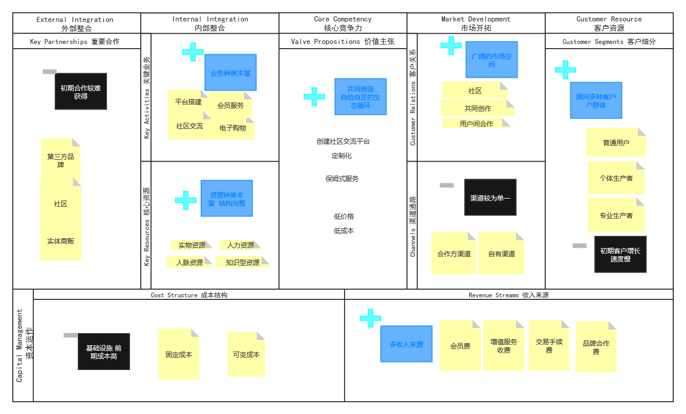
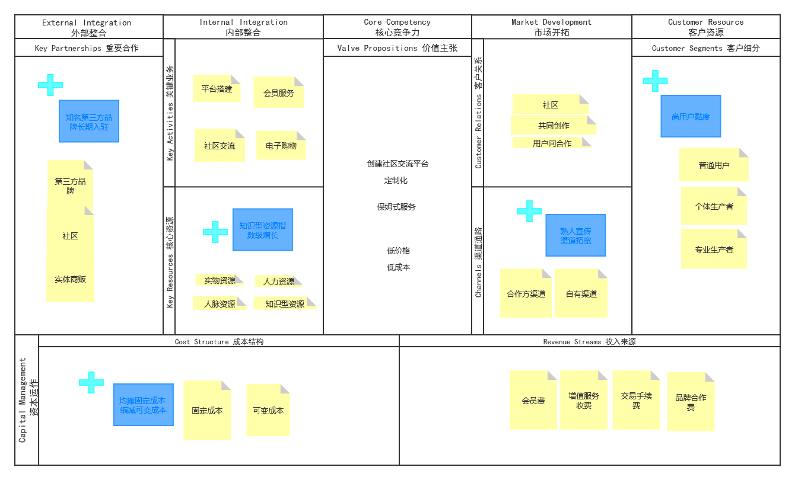
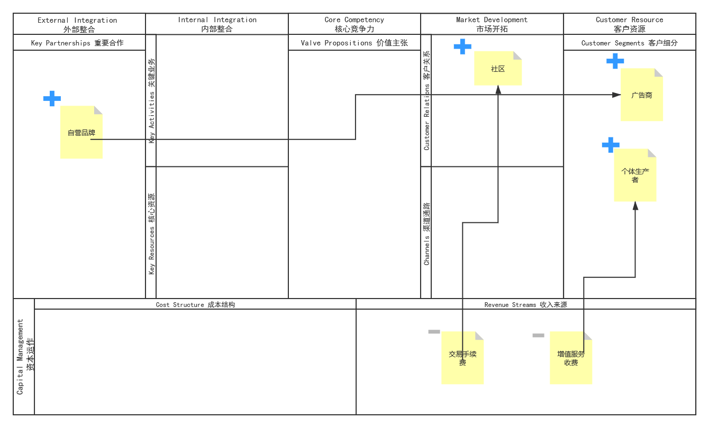
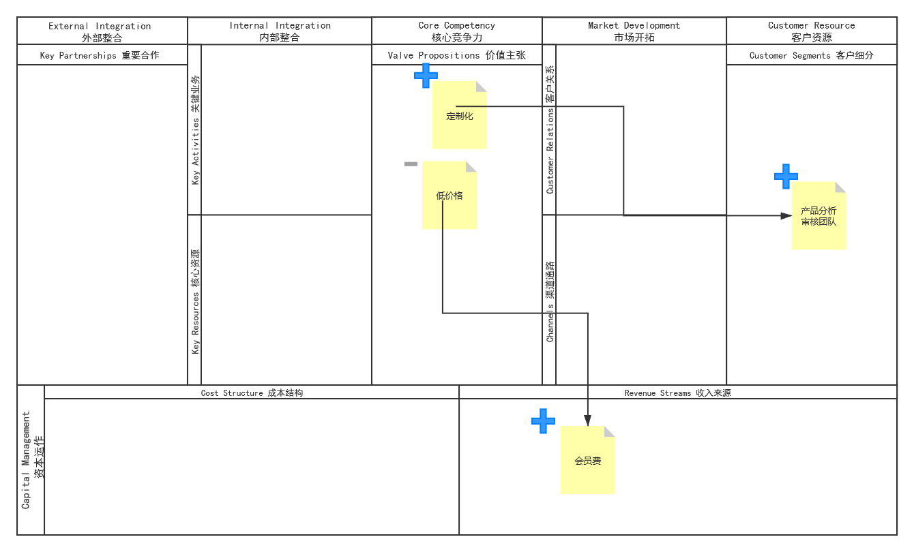
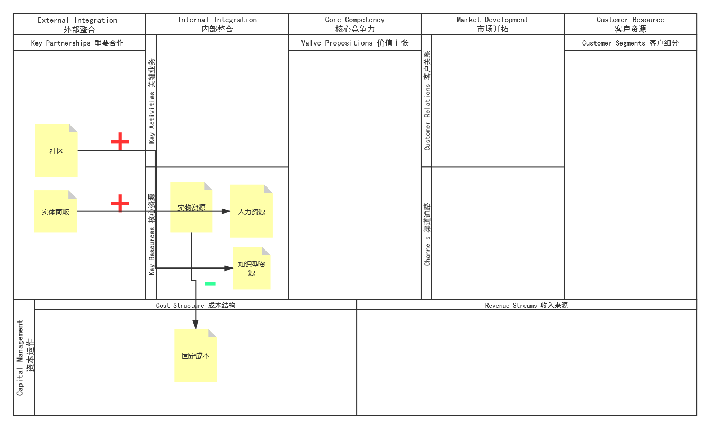
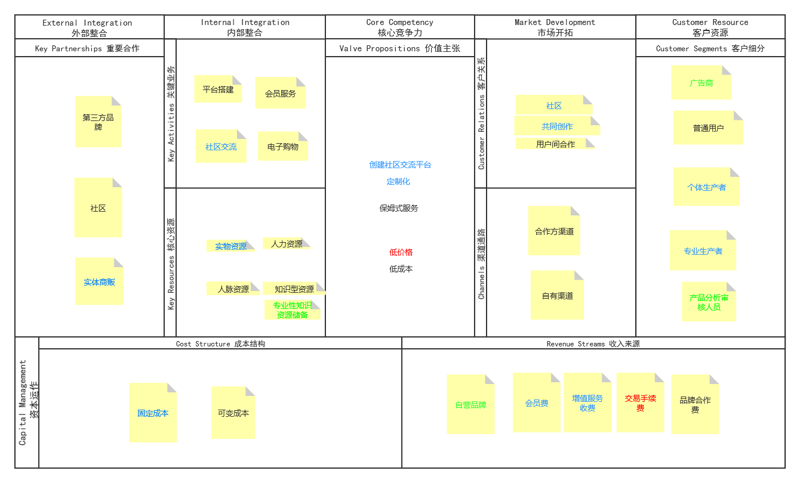

# 零居里商业模式评估文档

胡海川 181250046
刘瑞麒 181250087
黄雨晨 181250052
陈思文 181250013
2020年11月25日

[toc]

## 摘要

本项目为`零居里`小组在2018级秋季学期《需求与商业模式创新》课程中大作业设计的同名项目，此文档为商业模式评估文档。

## 1.总览

### 1.1 工作概要
本阶段中，我们小组结合上次作业的成果，使用了商业评估的方法重新审视了我们的商业模式。从问题出发，每人先思考我们设计的商业模式是如何体现这些环境要素的，然后调查类似产品和相关市场行情，找到支持的证据资料来佐证观点，最后汇总形成完整的环境图像。基于我们得出的环境结论，结合商业模式画布，评估产品将面临的机遇和挑战，对优点进行进一步改善并舍去不可修改或是无关紧要的要素。之后我们汇总创意，选出最能够发挥产品优势的几个要点构建蓝海战略，汇总和筛选先前的所有分析与评估，用于更新商业模式画布。

### 1.2 内容框架
在商业模式环境板块中，我们进行了极为详细的调研和同类历史产品的比较，从多角度对我们商业模式的目标环境进行评估。在商业模式评估板块中，我们根据所提出的问题一一对我们的商业模式进行评价，给出对应的分数并给出响应的分析或者理由。在蓝海战略板块中，哦们遵循“删除、削减、增加、创造”的格式来描写我们的解决方案，在原有的画布上标出被改变的要点，使得这种改变更为直观可感。在画布更新板块中我们画出最终更新后的画布，用不同的颜色分别标注了被删去，修改和新增的要点，并阐述了更新的要点内容以及其所引起的画布的要点和关系上的改变逻辑。

### 1.3 度量数值
总体评估加分项6项，减分项4项；SWOT分析中所有评分项都已打分并阐述了理由；引用的调研和报告总计30篇；画布修改要点18/34。

## 2. 商业模式环境

### 2.1 市场影响力

#### 2.1.1 市场问题

主要问题：从客户和供给的角度识别出驱动和改变你的市场的关键问题。

在我们设计的商业模式中可具体化为如下问题：是否存在足够多的潜在个体商户和用户来组成平台。

通过对现有传统电商及社交电商的观察得知，在互联网经济的影响下，越来越多的个体商户开始从事经营活动。这充分证明了小规模生产贩售的市场广阔。我们能从现有激烈竞争中分得份额的关键因素在于我们立足社区，并设立了更低的准入门槛，向下挖掘了目前尚未被开发的部分市场。从用户市场角度而言，由于电商平台用户的排他性相对其他产品相对较弱，竞争难度有所降低，能够缓解早期发展压力。

#### 2.1.2 细分市场

主要问题：识别主要的市场群体，描述他们的兴趣点，尝试发现新的群体。

在我们设计的商业模式中可具体化为如下问题：什么样的商户比起淘宝等现有平台更愿意选择我们的产品？什么样的消费者会青睐社区产品？

我们瞄准的商户是生产规模较小的商户。这类商户可以利用我们平台提供的基础服务（宣传、牵线等），在社区内进行经营活动。社区产品相比平台商品天生具有调性上的平庸，因此我们更多集中于中低收入地区的人口密集型社区进行客户发掘。其一确保了社交关系的密集，其二也利用该区域消费者的价格敏感性，充分发挥平价优势。

#### 2.1.3 需要与需求

主要问题：列举市场需求并分析这些需求被满足的程度。

在我们设计的商业模式中可具体化为如下问题：现有电商平台可以满足用户（包括商户和消费者）的购物需求了吗？

部分商户因为生产规模不足，以至于无法在现有电商平台施加的负荷（业绩压力，差价损失，服务费用）下达到营利，这类商户的应力需求尚未得到满足。在大部分平台场景下，消费者可以在电商平台找到需要的商品，但是更细致的服务需求和价格上的约束通常很难得到满足。立足社区的一大优势在于拉进了生产，销售，使用这些环节的距离，帮助商户及时得到用户更全面的反馈，也让用户在请求维修，个性化等其他服务时更加便捷。

#### 2.1.4 切换成本

主要问题:客户一旦转投竞争对手，哪些方面需要改变。

在我们设计的商业模式中可具体化为如下问题：如果商户选择其他电商平台，或是在发展至一定规模后转向其他平台，它需要付出哪些代价？

我们对自营商户中的优秀者进行合作内化，保证其在合法范围内无法擅自脱离，同时也确保我们在一定行业、一定区域内事实上的商业统治力。对于拒绝内化的优秀商户，考虑一定程度的商业施压。对于普通商户而言，切换平台的用户将会失去联盟便利，同时长久打造的社区口碑也会在很大程度上失去价值，再考虑到其资产较少，无法忽视重新置备基建的开销，因此其内在地不具有切换平台的动机。

#### 2.1.5 收入吸引力

主要问题:识别与收入心引力和定价能力相关的因素。

在我们设计的商业模式中可具体化为如下问题：除了手续费，电商平台如果作为中介角色获利？

在起始阶段，我们平台提供的低成本启动方式是巨大的吸引力。这将会为我们吸引大量的商户与消费者，并转化为流量收入。同时，对于缺乏经验或规模不足的商户而言，除了生产本身，还有宣传，物流等大量工作都十分费时费力，由平台介入完成可以帮助其成功，在获取增值服务收入的同时发展平台声誉，强化平台竞争力。

### 2.2 行业竞争力

#### 2.2.1 竞争对手

主要问题：识别现有的竞争对手和他们的相对优势

我们所提出的商业模式所涉及的领域不少，在不同方面所遇到的有**小红书**平台，**淘宝**，**京东**等平台。

淘宝

淘宝属于电商领域的大头。其优势在于良好的企业形象：淘宝提倡诚信、活跃、快速的网络交易文化，不仅如此，淘宝也是中国电子商务领域的开拓者和领导者。成熟的在线支付技术支持：安全支付是c2c平台的关键点，如果这个环节出现了问题，带来的损失是不可估计的。2013年10月，淘宝推出支付宝服务，从很多程度上解决了支付安全问题，维护了广大消费者和商家的利益。准确的消费者定位：5千元以下的中低端消费群体。而它的劣势在于卖家良莠不齐导致商业的信用问题，淘宝准入门槛低，开店成本极大的降低，有些不良商家，为了达到利益最大化，假货层出不穷，大量的水货、假货打击了消费者的购物信心，同时也影响了正品卖家的销售。极易牵涉到买卖双方，以及平台与商家的法律纠纷。同时由于竞争环境恶劣，互联网技术具有透明性，可复制性等特点，使得淘宝的一些创新的核心技术正在逐步的被竞争者复制并加以利用。百度、拍拍把当年淘宝打败易趣的免费政策完整地进行了克隆。目标客户群体：年轻，时尚，女性，小商店消费人群。成本结构：人员成本，运营人员，前期开发费用。

（https://www.sohu.com/a/312635784_494662 以淘宝为例的电子商务平台SWOT分析）

#### 2.2.2 行业新进者

主要问题：发现新的、崛起的行业对手，判断它们是否利用不同于你的商业模式与你竞争

小红书

小红书从社区起家，一开始，用户注重于在社区里分享海外购物经验，后来社区分享的内容触及了消费经验和生活方式的方方面面，属于社区加电商的领军平台。其优势在于小红书的核心是其购物心得分享社区，去中心化的社区有利于培养用户的参与度。同时由于用户主体为具有中高端消费能力和海外购物经验丰富的女性，其发帖质量远高于其他同类型产品的评论晒物版块，使得其社区的用户粘性极高，高质量的内容带动的是极高的转化率。当小红书升级为社区电商时，其产品的挑选采自用户帖子的精选内容，商品的精准度极高，这种从用户自身出发的商品挑选模式使得商品更容易击中用户的痛点。而它的劣势在于红书刚从社区升级为社区电商，初涉电商领域的他们暴露出很多问题。提供的产品品类、数量很少，不能满足其核心用户的需要，且没有建立一个包含退货、退款的售后服务体系。目标客户群体：具有中高消费能力的年轻女性。成本结构：人员成本，包括app系统推荐引擎的各种相关人员，市场人员，销售人员，管理人员等；广告宣传成本。他可能会吸走我们一定的客户，因为都是做社区这方面的服务。但是因为我们更具有本地化的特征，所以如果我们的产品能在本地获取一定的用户群体，那么我们的用户粘性一定是巨大的。

（https://www.maijia.com/info/461493 小红书运营分析）

#### 2.2.3 替代性产品和服务

主要问题：描述你公司的产品和服务的潜在替代品——包括其他市场和行业的产品和服务

淘宝只是占据电商这一方面，而我们从社区化和本地化，个性化的方式入手，电商不是我们服务的主导板块。小红书能基本代替我们的服务，它的视角也是从社区化开始，同时辅以电商的服务。淘宝的成本较大，因为在它的基础上开设网店的商家都是免费入住的，所以前期的网站开发费用等都是自掏腰包解决的，但是在成型后，有着巨大的市场，它可以通过广告收入，软件\租金\服务，淘宝的大流量来实现盈利。小红书的成本主要来源于人员成本，平台维护，合作支出和广告支出。而我们的成本结构和小红书的成本结构极其相似，但我们的规模较小，同时我们的电商服务也简化了不少。客户可能从我们的产品转入淘宝和小红书。淘宝的东西多且比较便宜，如果客户有更多的商品想要购买可能会赚到淘宝购物；小红书的推文内容丰富，如果客户想了解一个领域新型的信息可能会转到小红书社区了解信息，同时可能会有一些购物的消费。但我们的产品主要是本地化的服务，同时有着各种自产的商品，如果只是想要可靠质量的商品和保持社区之间的交流的话，我们的客户是不会太过大的转移的。

（https://www.680.com/it/1909/tb-154695.html 淘宝）

（https://www.sohu.com/a/339393935_120176728 小红书）

#### 2.2.4 供应商与其他价值链参与者

主要问题：在你公司所在的市场中，描述出目前关键的价值链参与者，并发现新崛起的参与者

价值链上的参与者包括：合作的商户和品牌，平台服务提供商等。我们对后者比较依赖，因为我们的服务是建立在平台提供给我们的服务之上的，如果没有平台提供的服务，当然也不会有我们的产品产生。而合作的商户和品牌只是我们在提供服务中的一部分，虽然没有平台服务商那么重要，但是也是站我们的合作关系的重要一环，对我们产品的设计有着重大的影响。边缘玩家：目前未发现。当然合作的商户和品牌是利润相对而言较高的那一方，因为我们和他们是持续性的信息交流和服务提供。

#### 2.2.5 利益相关者

主要问题：确认哪些参与者可能会影响你的公司和商业模式

第三方平台和实体商贩是利益相关者，在我们产品初期运营的时候，和他们合作有助于我们产品的宣传，提高知名度。股东可能会影响产品日后的发展走向，政府对我们没有太大的影响，只要我们的服务是合法的。对于员工我们可以减少工作时间，给予员工更多的假期。

### 2.3 关键趋势

#### 2.3.1 技术趋势
主要问题：识别威胁你的商业模式的技术趋势，以及能推动你的商业模式进步的技术趋势。

在我们设计的商业模式中可具体化为如下问题：我们的平台是否顺应了什么新的电商理念，相较于其他平台在运营方面有什么优势？

平台让发现产品和服务更容易了。然而由于法规或传统的工作方式，电商平台并没有很透明，因为中间还夹着代理商。我们的平台模式对传统中间商提出了质疑，因为我们将定价权完全交给了客户和生产者，只提供了更多的定价对比，信息也更透明了。这一点上是基于旧的平台模式的创新，能够有效避免差价问题，提升用户购物体验。以社区为落脚点一定程度上增加了可信度。

(https://baijiahao.baidu.com/s?id=1601076802711924060&wfr=spider&for=pc 电商新零售时代背后的技术支撑)

(https://blog.csdn.net/weixin_42852136/article/details/86599970 小红书社区技术)

#### 2.3.2 行业管理趋势
主要问题：描述影响你的商业模式的管理规定和管理趋势

在我们设计的商业模式中可具体化为如下问题：本平台需要注意什么相关法律法规？

依据2018年8月31日颁布、2019年1月1日正式启用的《中华人民共和国电子商务法》的相关规定，本平台将会加强消费者和生产者双方的个人信息保护，严格把控产品质量，拒绝“大数据杀熟”现象和搭售现象。

(https://baike.baidu.com/item/%E4%B8%AD%E5%8D%8E%E4%BA%BA%E6%B0%91%E5%85%B1%E5%92%8C%E5%9B%BD%E7%94%B5%E5%AD%90%E5%95%86%E5%8A%A1%E6%B3%95/16467544?fr=aladdin 中华人民共和国电子商务法)

#### 2.3.3 社会和文化趋势
主要问题：识别可能影响你的商业模式的社会趋势

在我们设计的商业模式中可具体化为如下问题：以社区为载体的电商能否吸引顾客消费？

如今，内容电商正成为新的流量入口和未来发展趋势，这是内容传播渠道和产品销售渠道前所未有的深度融合。本平台以社区为载体，将有需求价值的内容，通过品牌主、本平台、社区的整合传播，精准触达目标用户，从而实现购买转化。将传统的赤裸裸的直接买货，转变为棘突有需求价值的内容去影响消费者的购买行为。本平台会员服务中的保姆式服务包含了这一点。

(http://www.woshipm.com/it/2041780.html 社区电商：一场流量狂欢or发展必然？)

#### 2.3.4 社会经济趋势
主要问题：总结和你的商业模式有关的主要社会经济趋势

在我们设计的商业模式中可具体化为如下问题：本平台能否符合社区的消费特征呢？

在社区范围内，人们大都以家庭为单位消费各种生活资料，解决吃、穿、住、用等日常生活需要。人们通过长期共同生活建立了多种人际关系，并且借助这些人际关系互通有无、交流感情、共同解决生活困难和思想难题。本平台致力于推进社区内部与社区之间的商品交流，注重生产者与消费者之间的直接交流。

(https://www.chinaz.com/web/2008/1106/43580.shtml 消费者网络社区群体消费行为的特征)

### 2.4 宏观经济影响

#### 2.4.1 全球市场情况
主要问题：识别当前经济是否处于爆发期，分析总体市场的情绪，GDP的增长率和失业率等问题。
在我们设计的商业模式中可具体化为如下问题：平台是否满足特定用户的特定需求？                    
对于长期在家，业余生活单调，有一定社交困难的居民来说，零居里平台是一次绝佳的打开窗户，呼吸新鲜空气的机会，它能让使用者自然的，毫不费力地结交有相同兴趣爱好，需求的周边人。据调查显示，90%的人或多或少都有社交恐惧症。
https://www.sohu.com/a/238750375_72677 ,这其中包括社交焦虑，社交障碍等等。依靠自身来突破心理的障碍有一定难度，并且做到高效的点对点社交更不是一件容易的事。从线上社交过渡到真实生活中的社交(通过线下交易)，并事先通过动态，聊天等方式了解彼此，这样无论是成功率和效果都更胜一筹。可以说，零居里充分挖掘并满足了客户的心理需求。

#### 2.4.2 资本市场
主要问题：所处的资本市场处于什么状态，获得投资的难易程度以及便捷程度，获取投资的成本有多高。
在我们设计的商业模式中可具体化为如下问题：我们的平台能否顺利获得启动资金进行开发。
基于社区的购物交流平台是一个崭新的概念，通过向社区管理者进行介绍推荐，再将信息普及到整个社区，可有效地吸引社区居民的兴趣，从而筹集启动资金。

#### 2.4.3 大宗商品和其他资源
主要问题：描述业务必备的大宗商品和其他资源的市场状态，是否容易获取，成本如何？
在我们设计的商业模式中可具体化为如下问题：平台是否容易获取实物资源，知识性资源以及人力资源，以及为了获取这些资源的成本如何？
平台采取基于社区的种草模式，实物资源，人力资源在初期需要一定的支持；在平台运作进入稳定期后，除了需要付出一小部分的成本来人为维护平台，其余资源都由使用者所在的生态提供，无需外部输入。至于知识性资源，收集用户动态信息是主要方式，此外也可由第三方进行输入。

#### 2.4.4 经济基础设施
主要问题：如何评价当前市场的基础设施和人民的生活质量？
在我们设计的商业模式中可具体化为如下问题：根据当前人民的生活水准，人们是否有使用零居里平台的经济基础？
显然，人们的生活水平在逐步提高，开始在吃饱穿暖的基础上追求个人价值，社会认同等高层次目标。社交成为必不可缺的途径，零居里是面向社区，社交的交流购物平台，能够很好的满足人们日益增长的精神物质需求。

## 3. 评估商业模式
### 3.1 总体评估  
分析：

我们设计的商业模式总体上是一个社群交流平台，具有地域性，日常性等使用特征。由于社区的活跃必须依赖一定规模的客户群体，所以我们对客户资源的依赖度尤其高。这对于处于初期的产品是有着一定风险的，一旦产品没有得到足够的宣传或是没有吸引足够数量社区居民的兴趣，将会面临生态发展缓慢的困境，甚至会出现部分老用户失去耐心从而"脱坑"的现象。在这一点上，我们通过增加客户细分，面向更加广泛的客户群体予以一定程度的弥补，并且加大前期宣传力度，保证产品在初期的平稳发展。由于平台本身的发展模式是无监督的，依赖于使用者本身，在形式上更像一个闭环，所以在内部整合方面会做的更为细致，以应对用户可能出现的各种需求；并在各个环节之间产生关联，使得资源能够无障碍地传递，减少损耗浪费的情况。在关键业务方面，我们并重种类与品质；在核心资源方面，我们在强调知识型资源的基础上充分利用人力资源，以线上带动线下。  
在核心竞争力方面，我们基于五个特征对产品进行评估。定制化是目前市场上产品发展的趋势，平台在未来的发展过程中会被逐渐划分为多个板块，为有不同需求/兴趣爱好的用户提供定制化的服务。低价格低成本是由于我们削减了很多种中间过程和环节，比如在购物这一块，就省去了生产-销售-运输这两个环节成本的累加，让利于用户，这也是我们相对于传统电商的最大优势。保姆式服务是考虑到我们面向的用户大部分并非专业人士，缺少生产销售的经验，所以提供更为完善的引导措施，这一点也会帮助产品在初期吸引更多对产品本身缺少了解的新用户。  
当然平台也不可避免地存在着一些缺陷和不足。在重要合作方面，如何吸引第三方品牌，何时引入第三方品牌，怎样筛选第三方品牌都是需要长期思考的问题，并且由于缺乏经验，前几次的尝试很可能会出现意外甚至失败，也有可能导致平台的性质发生变化，所以在做这方面的尝试一定要尤为谨慎。在成本结构方面，产品初期显得相对困难，由于缺少收入来源加上运营时间短无法均摊成本，我们决定先专注于少数几个社区，尽可能减少初次固定成本，后期增量式地投入更多。  
在收入来源方面，我们认为产品的可盈利手段较为丰富。由于功能划分较细，不太会出现重叠的现象，因而每一项收入来源理论上都会呈现稳定的趋势，并且在预期中平台用户黏度高，范围确定，收入情况在短期内不会出现大的波动。后期可通过扩展增值服务，提高品牌合作费来进行创收，这也是比较灵活的。  
展望：

在重要合作方面，通过展现平台稳定的生态和用户圈吸引优质第三方品牌长期入驻，和用户互动形成良性循环。在核心资源方面，引导用户进行知识型资源的输出，丰富平台的知识型资源储备，形成多层次更深厚的平台背景和底蕴。以老用户带动新用户，促进资源更新替换，达到指数级的理想水平。在成本结构方面，由于平台运作时间增长，固定成本会被均摊后降低，维护成本会自然下降。固定平台的运作模式，减少决策失误，降低可变成本。在渠道通路方面，发展初期渠道较少，我们寄希望于后期的"熟人效应"，由于客户地域分布的集中性，这点在理论上会被实现。最后是客户细分方面，在产品发展的过程中会逐渐对客户进行划分，并以此规划平台各个板块的设计，实现点对点针对性的有效服务，让客户高效地进行交流互动，提升客户的满意度吸引客户常驻。

### 3.2 SWOT

#### 3.2.1 价值主张评估

|              问题              | 评分 | 解释                                                         |
| :------------------------------------: | ---- | :--------------------------------------------------------: |
| 我们的价值主张良好 匹配了客户的需求      | 2   | 我们的价值主张基本满足客户的需求，社区交流、自制产品推广和小电商是我们产品提供的主要服务，同时也含有保姆式定制式服务。但一些服务细节没有在价值主张里体现 |
| 我们的价值主张有很 强烈的网络效应       | 4    | 我们的价值主张是有很强的网络效应的，创建创新的社区交流平台是我们打造产品的第一步。在初期我们可以和第三方品牌和实体商贩合作，这样扩大我们产品的宣传，同时通过我们低价格，低成本价值主张吸引大量的用户。在这样的社区交流平台逐渐扩大后，我们就会有更多的用户通过社区的渠道进入我们的服务范畴，同时我们可以再发展会员、定制化和保姆式服务。 |
| 我们的产品和服务是 强耦合的      |   3 | 我们是以提供社交服务为主、小电商服务为辅的公司，所提供的产品即是 PC 端的网站、软件和移动端的app，产品和服务之间是强耦合的关系。但美中不足的是，产品在一些细节上的打磨没能保证服务的优质性(话题挖掘和环境打造等)，我们可以对产品设计进行优化进而提供更好的服务。 |
| 我们的客户很满意      | 2 | 我们的产品是具有创新性的（区域化、社区化），所以可以给用户带来新奇体验，但由于初期对社交环境和电商过程监管的考虑不周，我们预计会收到一些用户投诉。这是我们在此次设计中需要着力改进的地方。 |

#### 3.2.2 成本/收入评估

|              问题              | 评分 | 解释 |
| :-------------------------------- | ---- | :----------------------------------------------------------- |
| 我们有很高的利润 | 4 | 会员费的本身定价不会太高，但是因为整体的基数还是较大的，整体的收入还是不错的。同时，定制化和保姆式服务本身的定价是比较高的，但是因为服务的价值和吸引力在那里，我们也可以靠它们获得可观的服务。品牌合作费也占据我们收入主干成分。而交易手续费只是一个很小的方面，这部分收入会有，但不会成为主要收入。所以，综上所述，我们的产品还是有较大的利润。 |
| 我们的收入是可以预期的 | 3 | 品牌合作费是可以预期的，因为是提前签订的协议。而会员费收入和定制化保姆式服务原本是可以预期的，但我们没有做好很细致的划分，这次改进可以引入年卡、连续包月等方式保证收入的可预期性。交易手续费可以同时以前的数据来做一个粗略的估计。 |
| 我们有很多经常性收入，有很多回头客 | 3 | 会员费收入属于经常性收入，因为会员费本身不会有很高的定价，我们预计大部分会员在到期后会续约，保证收入的经常性。而定制化和保姆式服务虽然不能算作经常性收入，但是因为这种服务的高价值，会吸引很多的回头客。同时我们的平台特有的业务可以留住顾客，能让用户继续使用我们 的平台，继续在平台上消费，使得平台有经常性收入 |
| 我们的收益来源是多样化的 | 2 | 我们主要的收入来源来自于:会员费，增值服务费用，交易手续费用，品牌合作费用 |
| 我们的收益来源是可持续的 | 1 | 我们倡导的是一种社交之上囊括自制小商品的贩卖，同时满足当地人的需求，所以我们有信心我们的服务最终会融入进许多当地人的生活之中，成为日常的一部份，进而保证收益来源是可持续的。同时我们的会员费可以设置成自动续费的功能，能让用户一直使用我们的平台。 |
| 我们在支出成本之前就有收入进账 | -4 | 我们在平台服务还没有搭建好之前还没有收入来源 |
| 客户真正想买的就是我们提供的 | 5 | 我们了解当地用户的诉求，站在他们的角度上思考我们产品应该提供什么，所以我们确定我们提供的就是客户想买的。社区化的交流平台，自制商品的分享和贩卖，以及定制化的服务，让用户能更方便的对自己的小品上手操作售卖。 |
| 我们的定价机制能够抓住客户全部的购买意愿 | 1 | 我们的会员费相对于同类型的平台价格较低，能让用户在对比多家平台之后因为价格低选择我们。 |
| 我们的成本可以预测 | 3 | 我们的成本中开发的费用是我们自己制定和调控的，平台人员管理费是基于市场行情可以预测的，这里面的未知因素是广告推荐费，服务提供商开销，这些成本本身浮动很大，且我们具体在这里投入多少需要视情况而定，但如果效益不好，我们可以省去这部分支出。因此，我们的成本从总体而言是可预测的，但会有一小部分的变化无法预测，不过这部分变化也是我们可以控制的。 |
| 我们的成本结构正确地匹配了我们的商业模式 | 2 | 我们花费的成本主要在前期的宣传和社区推广中，当然除此之外，服务商的联系与合作也是成本的一大来源，它们匹配我们的多边平台商业模式。 |
| 我们运营的成本效率极高 | 1 | 我们的成本种类比较多，而且其中社区宣传费，和服务商合作费预计会消耗大量资金，我们的收入则主要依赖于会员费，定制化和保姆式服务提供费，这样设计的结果很可能导致前期我们的投入太大，所以我们需要足够的资本来完成。 |
| 我们从规模经济中获益 | 3 | 在初始阶段，我们进行大规模的资本投资，提供满足基本需求的产品 ，大规模的发展客户，以求达到规模经济性。当客户规模上来之后，我们的服务稳定性和客户粘性已经达到一定阶段，在原有资产的基础上，只要再增加少有的改造就可以创新更多的业务，满足客户多样化的需求，所以我们可从规模经济获益。 |

#### 3.2.3 基础设施评估

|              问题              | 评分 | 解释 |
| :----------------------------- | ---- | :----------------------------------------------------------- |
| 竞争对手很难复制我们的核心资源 | 4 | 我们的核心资源在于我们搭建的本地化社区，这是由用户和我们共同创造的，比如平台上的社区交流和自制商品询问，竞争对手是无法复制的。 |
| 资源的需求可以预测 | 3 | 我们的核心资源主要是实物资源，人力资源和知识性资源。实物资源可以通过社区中的人员需求和反馈交流获得信息，人力资源可以由我们平台的处境和发展情况预测大概需要多少人力资源，而知识性资源也由用户产生，所以比较难预测。 |
| 我们在正确的时间部署了合适的资源 | 5 | 社区化和本地化是小区的需求，它们需要一种这样可以实现社区社交的软件。 |
| 我们有效地执行了关键业务 | 2 | 我们将视频平台集成到社交社区中，加强了客户之间的互动；并且我们会采取对 社区平台进行一系列管理。 |
| 我们的关键业务很难被复制 | 1 | 我们的本地化社交和保姆式业务、自制商品售卖在竞品平台中比较少见，比较难被复制，但是电商、社区化交流平台、定制化服务等业务在众多平台中都有普及，容易被复制。 |
| 执行质量很高 | 2 | 我们的每一个关键业务都有高质量的执行。 |
| 我们的自有活动和外 包活动达到了理想的平衡 | 4 | 我们的关键业务之间彼此相连，一系列功能都是在小商品和社交平台中不可或缺的，用户可以通过平台享受基础服务也可以享受自己愿意享受的增值服务。 |
| 我们很聚焦，并且在必要的时候与伙伴合作 | 5 | 我们聚焦于自制商品贩卖，所以非常必要和第三方品牌和实体商贩合作 |
| 我们与重要合作伙伴的关系很融洽 | 4 | 第三方品牌和实体商贩是我们的主要合作对象，我们必须维持良好的合作关系 |

#### 3.2.4 用户界面评估

|              问题              | 评分 | 解释 |
| :----------------------------- | ---- | :----------------------------------------------------------- |
| 客户流失率很低 | 5 | 我们的产品主要是本地化的服务，同时有着各种自产的商品，如果只是想要可靠质量的商品和保持社区之间的交流的话，我们的客户是不会太过大的转移的。 |
| 客户群被很好地分类 | 2 | 我们的客户大致分为：社区普通用户，第三方品牌和实体商贩。 |
| 我们不断地获得新的客户 | 3 | 社区之间的宣传，与社区普通用户，第三方品牌的合作都能为平台带来新客户。 |
| 我们的渠道很有效率 | 4 | 我们通过合作方渠道宣传，比如社区普通用户，第三方品牌这样的合作方宣传能够迅速获得新的用户。同时我相信我们的自有渠道也能获得新的用户。 |
| 我们的渠道有很好的效果 | 2 | 我们通过合作方渠道宣传，比如社区普通用户，第三方品牌这样的合作方宣传能够迅速获得新的用户。同时我相信我们的自有渠道也能获得新的用户。 |
| 渠道链接客户的能力很强 | 1 | 每个手机用户至少会装一个应用商店 |
| 客户能够轻易地看到我们的渠道 | 3 | 每个手机用户至少会装一个应用商店，所以用户比较容易接触到我们的渠道。但是如果得不到应用商店的推荐，就只能通过社区宣传了。 |
| 渠道被高度整合 | 4 | 应用商店和社区是整合度较高的渠道 |
| 渠道产生了规模经济 | 5 | 在扩展渠道通路的同时，可以获得更多用户，从而受益更大。 |
| 渠道良好地匹配了客户群体 | 4 | 用户通过多种渠道了解我们的渠道的，即应用商店，社区等。所以能良好的匹配很多的用户。 |
| 客户关系强 | 5 | 共同构建，用户可以上传自制商品介绍和推文。形成我们的知识性资源。 |
| 关系质量正确地匹配了客户群体 | 2 | 我们提供了问题反馈机制，用户通过这种方式可以与我们建立良好的关系。 |
| 客户切换的成本很高客户和我们绑定了关 | 4 | 用户在社区的生活和交流很有可能会用到我们的商品，因此用户不会轻易离开。 |
| 我们的品牌很强 | 5 | 市场上唯二的社区交流平台 |

### 3.3 机会评估

#### 3.3.1 价值主张中的机会

| 问题                                                | 评分 | 解释                                                         |
| --------------------------------------------------- | ---- | ------------------------------------------------------------ |
| 我们可以将产品转化为服务来获得重复增加的营收吗      | 2    | 我们平台业务的一个主要方面本身即是针对小型商户的营业辅助服务。 |
| 我们能更好地整合我们的产品或者服务吗                | 5    | 我们可以为商户根据需要定制增值服务，如针对地域，品牌的营销手段，针对人群的促销策略设计，同样，为消费者推荐易得的，满足其消费喜好的特定商品，促进双方获益。 |
| 还存在与我们的价值主张互补或是延申的东西吗          | 4    | 我们的价值主张宣扬低成本，低门槛的经商，但我们同时也对优秀商户采取进一步培养措施，纳入自有品牌体系，这一互补增大了平台的受众面积。 |
| 我们还可以满足哪些额外的客户需求                    | 3    | 我们已经满足了用户的主要需求（低成本经营，便捷购物，可定制化），接下来可以着手社区互信基础对商品的质量保障作出探索。 |
| 在服务客户的过程中， 我们还可以为客户做哪些其他工作 | 3    | 我们可以协同社区对商户进行有效推介，还可以牵线推进社区间良性合作。 |

在收入来源部分，注意到同时存在增值服务收费和会员费。这里应该需要细化一下，例如对已经付费的会员来说，考虑取消其部分的增值服务费，或是采用一些优惠政策。这样如果用户开通了会员，就可以免费或是以极低的额外成本来使用平台的各项其他服务，减少了收费项目，有利于促进普通用户转向会员的转化率。同时删除交易手续费，使我们的交易更透明，更利于平台氛围建设。

#### 3.3.2 成本收入中的机会

| 问题                                       | 评分 | 解释                                                         |
| ------------------------------------------ | ---- | ------------------------------------------------------------ |
| 我们可以将一次性交易收入转换成经常性收入吗 | 5    | 我们的主要收入来源为增值服务，这类服务在商户发展过程中的需求是持续且多变的，社会风口本身的快速变化也对宣发，运营提出不断进步的要求。因此客户会倾向于订阅式地持续消费我们的服务。 |
| 还有什么产品或服务是客户愿意付费的吗       | 2    | 由于放弃了中介费，我们的收入来源较为集中，主要包括商户的增值和自由品牌的收入。其中前者本身已经包含了相当广阔的内容，进步空间较小，可以由自有品牌的建立入手，从消费者端获取额外的利润。 |
| 在我们内或者合作伙伴那有没有交叉销售的机会 | 3    | 在与社区合作的过程中，社区本身也可以作为商户加入平台，利用我们的渠道达到盈利目的。除此之外，我们还可以联系部分竞争关系较弱的现有电商平台，把来自平台入驻商户的自制商品加入其中，在丰富对方平台内容的同时创造更多销售渠道。 |
| 我们还能增加或创造出其他的收入来源吗       | 2    | 平台类产品的收入渠道本身类别较为单一，难以拓宽。但是现有的基础流量收入将会随着平台规模上升自动增加。 |
| 我们能否提高价格                           | 3    | 在平台提供的辅助效果增加的情况下，我们可以提高服务的费用。由于我们提供的是按需定制的辅助服务，这一涨价行为引起的负面影响并不严重。 |
| 我们在哪个环节可以缩减成本                 | 2    | 当平台具有基础规模和自我造血的能力后，我们可以削减推广方面对接社区的开销。 |

#### 3.3.3 基础设施中的机会

| 问题                                               | 评分 | 解释                                                         |
| -------------------------------------------------- | ---- | ------------------------------------------------------------ |
| 我们能否在保持相同结果的同时，使用成本更低的资源   | 4    | 我们对自有品牌的内化合作也包括了对其资源的吸纳，这将会大大降低我们为其他商户提供帮助时的开销，如垄断式的行业定价权，特定区域的高效物流复用等。 |
| 哪种核心资源从合作伙伴那获取效果会更好点           | 3    | 我们主要利用合作伙伴（社区）的宣发渠道。考虑到平台的特殊性（社区电商），大范围的产品宣传是一种浪费，有社区代为进行可以达到事半功倍的效果。 |
| 哪种核心资源没有得到充分利用                       | 1    | 大部分资源已经被妥善利用，在社区渠道建立完毕后可以适当减少宣传所需的人力。 |
| 我们有没有什么未使用过的有价值的知识产权吗         | 2    | 可以进一步利用用户发表的测评为商户提供生产指导意见。         |
| 我们可以对某些关键业务实施标准化流程吗             | 3    | 可以用确定性地，量化的方式具体评估每个社区的开发潜力，确定资源投入的最近份额，提高利润。 |
| 我们该如何从整体上提高效率                         | 3    | 各区域的组织者及时反馈当下的地区行业动向，帮助公司的商业智囊服务提升质量。 |
| IT 技术支持能提高效率吗                            | 4    | 使用 IT 技术对商户的引导和考核进行标准化有助于对保证品牌形象，也方便对相关信息做进一步的财务分析。 |
| 是不是存在一些业务外包的可能                       | 3    | 因为平台并不是技术导向，IT 支持可以考虑外包，最大程度缩减人力成本。 |
| 与合作伙伴更深入的合作是否有助于我们更专注核心业务 | 1    | 否，核心业务是对商户的栽培与内化，社区只能在发展初期提供曝光，意义有限。 |
| 在我们与合作伙伴的关系中存在交叉销售的机会吗       | 3    | 在合作的过程中，社区可以作为商户加入平台，利用我们的渠道贩售商品，达到盈利或是包括推动社区建设（如监控添置）在内的一系列目的。 |
| 我们合作伙伴的渠道通路可以帮助我们接触客户吗       | 3    | 社区可以提供消费者渠道，但更为核心的商户方面需要我们自行调派接触，以确保提供更适当的服务，增强商户粘性。 |
| 我们的合作伙伴能够补充我们的价值主张吗             | 1    | 不能。                                                       |

#### 3.3.4 用户界面中的机会

| 问题                                                         | 评分 | 解释                                                         |
| ------------------------------------------------------------ | ---- | ------------------------------------------------------------ |
| 我们应该怎样利用日益壮大的市场                               | 4    | 考虑从加速流量变现，推进商户合作，利用市场上升趋势诱惑平台消费者转型成为产户等方面利用市场发展红利。 |
| 我们能服务新的客户细分群体吗                                 | 1    | 不能。                                                       |
| 我们能通过更为精细的客户细分群体来更好地服务客户吗           | 3    | 我们对于商户当前的划分仅根据其规模和盈利潜力进行。可以考虑对不同类别的商户（知识变现、商品零售等），提供针对性增值服务，增加平台的利润空间。 |
| 我们该如何改善我们渠道通路的效率和效能                       | 3    | 我们目前主要的宣传渠道是对接社区，之后可以增加对平台消费者的激励，充分利用人传人方式打开市场。 |
| 我们能更好地整合我们的渠道通路吗                             | 1    | 不能。                                                       |
| 我们能在合作伙伴那发现与我们的渠道具有互补性的渠道通路吗     | 2    | 社区提供的渠道相当重要，是渠道通路的主体。我们自有的渠道通路量级相当轻，无法呈互补状态。 |
| 我们可以直接服务我们的客户来提高我们的利润率吗               | 1    | 我们已经是直接面向企业提供服务的模式了。                     |
| 我们能否更好地平衡渠道通路与客户细分群体之间的关系           | 4    | 当下的模式是社区渠道接触到平台用户，并将其中部分转化为商户，再择优内化。在未来可以通过平台内宣传催化从消费者用户到商户用户的转化，增大基数从而增大品牌级别合作商户的比例，达到优化用户结构的目的。 |
| 在针对客户的售后服务上，还有什么改进的空间吗                 | 3    | 平台经营初期仅依靠社区互信，难以确保产品质量，在规模发展后会引入审核、仲裁等监管手段，确保消费者满意度。对商户的服务本身属于订阅类，售后服务集中表现在从发现问题到解决方案落地的长时间跨度的保姆式服务。 |
| 我们应该如何加强我们与客户之间的关系                         | 3    | 主要通过面向商户的定制服务增加商户对平台的信任度与依赖性。   |
| 我们能在服务的个性化上加以改善吗                             | 4    | 我们可以通过社区测评与用户反馈改善生产过程，即 C2M 模式，提供更具有个性，符合需要的商品给消费者。 |
| 我们应该怎样来提高客户的转移成本                             | 3    | 作为平台类产品，我们对消费者不做过多的粘性要求（因为消费者选择平台不具排他性，因而竞争较弱）。对于商户，我们采取签约深度合作的方式控制头部选手，同时采取合理尺度内的联盟垄断确保普通商户的粘性。 |
| 我们是否已经发现并放弃了不能为我们带来收益的客户，如果没有，为什么 | 1    | 无，无佣金机制代表大部分消费者不会带来直接利润，但其基数产生的宣传效果和对商户的更大吸引力对平台来说同样重要。 |
| 我们需要自主化一些关系吗                                     | 3    | 对于消费者关系，我们交给社区与合作商户复杂，确保精力集中，对于商户，我们吸纳其中的优秀者，建立品牌护城河，并最大程度地做到普通商户友好，保持口碑。 |

### 3.4 威胁评估

#### 3.4.1 对价值主张的威胁

| 问题                                  | 评分 | 解释 |
| ------------------------------------- | ---- | ------------------------------------------------------------ |
| 市场上存在可替代我们的产品和服务吗 | 4 | 目前存在规模较大的社交电商平台，但是我们具有独特的针对社区的特点，即细分平台下的垂直模式，有深入发掘抢占市场的能力。 |
| 竞争对手会报出更有竞争力的价格，或者提供更好的价值吗 | 5 | 我们的平台基于社区，这使物流费，宣发费的大幅缩减，同时我们选择不收取佣金，保证了我们平台的价格总是优于竞争对手。 |

#### 3.4.2 对成本收入的威胁

| 问题                                  | 评分 | 解释 |
| ------------------------------------- | ---- | ------------------------------------------------------------ |
| 我们的利润受到竞争对手的威胁吗?是技术原因造成的吗? | 3 | 竞争对手主要的威胁在于抢夺商户，这可能对平台造成一定威胁。这主要是资源原因造成的。 |
| 我们过多的依赖某一 项或者多项收益来源 吗? | 3 | 我们对增值服务的依赖过重，可能在早期面临资金短缺。 |
| 未来哪些收益来源会消失? | 5 | 平台的大部分收益都是长期可持续的稳定收益。 |
| 哪几项成本会变得无法预测? | 4 | 平台的运维成本基本为固定成本，预想内可能出现大规模增长的是随着规模增大而增大的人力成本（需要更多人进行推广，审核等操作） |
| 哪些成本的增加会快过他们所支撑的收入? | 4 | 唯一增加可能较大的人力成本将伴随着社区规模与质量的上升，损失可能性较小。 |

#### 3.4.3 对基础设施的威胁

| 问题                                  | 评分 | 解释                                                         |
| ------------------------------------- | ---- | ------------------------------------------------------------ |
| 我们会面临某些资源的供应短缺吗?       | 3    | 不会，我们的核心资源都是充足的                               |
| 资源的质量能够保证吗?                 | 2    | 资源的质量是我们的核心资源，它是能够保证的                   |
| 哪些关键业务会被打扰?                 | 1    | 不会，如今的外部力量不会打扰到我们的关键业务。               |
| 我们的活动质量会受到威胁吗?           | 4    | 不会，因为我们提供的服务都是稳定的                           |
| 我们有可能会失去哪些合作伙伴?         | 1    | 我们应该不会失去合作伙伴                                     |
| 我们的合作伙伴有可能和竞争对手合作吗? | 1    | 可能，第三方品牌和实体商贩很有可能和其他电商平台合作         |
| 我们是不是过分依赖某些合作伙伴了?     | 4    | 并不是，我们的服务除了合作还有平台提供的增值服务，它们也占据了我们服务一大部分。 |

#### 3.4.4 客户界面上的威胁

| 问题                                  | 评分 | 解释                                                         |
| ------------------------------------- | ---- | ------------------------------------------------------------ |
| 我们的市场很快会饱和吗？              | 1    | 我们的市场确实很容易就饱和了，但是我们可以开拓更大的市场。   |
| 有竞争对手在威胁我们的市场份额吗?     | 3    | 目前不存在有威胁性的竞争对手，除了普遍性的电商平台等，但他们和我们的理念不太相同。 |
| 客户转投竞争对手的可能性有多高?       | 4    | 比较小                                                       |
| 我们市场中的竞争多快会变得白热化?     | 2    | 我们的平台和竞争对手的平台各自有各自的特点，并不是完全对立的，不会很快竞争白热化。但是又有一部分的功能是相似的，会产生一些用户的竞争。 |
| 竞争对手会威胁我们的渠道吗?           | 1    | 应该不会                                                     |
| 我们的渠道有变得和客户不相关的危险吗? | 3    | 不会，和客户紧密相连                                         |
| 我们的客户关系有可能恶化吗?           | 4    | 不太可能，因为我们设置了问题反馈机制，能根据客户的反馈调整我们的行为。 |

## 4. 蓝海战略
### 4.1 对客户的影响

+ 删除：交易手续费
+ 削减：专业生产者、增值服务收费
+ 提升：社区，共同创造，个体生产者，广告商
+ 创造：自营品牌，品牌合作费

我们构思的“零居里”商业模式聚焦于社区，聚焦于如何提高个体用户黏度。正如前文分析，无论是传统线下商超，、还是现有电商平台，都存在一定的缺口。因此专注于继续开拓这些市场，挖掘潜在用户是我们平台的主要方向。而对于这类电商网站，用户对于广告是很依赖的。如果没有足够的广告宣发，用户可能会难以体验到我们的核心业务。

对于广告的内容和形式来说，需要有较高的要求和取舍。因为我们不应该为已经成熟的电商打广告，这会使得交易脱离我们的初衷。我们需要扶持的，是基于我们平台发展起来的，与社区有很高粘合度的品牌或个体生产者。

减少付费项目的条目的另一个考虑就是促进社区共同创造的客户关系。对于基于社区交流的小规模电商平台来说，应该营造一种分享和互助的气氛，如果付费项目过多，对这种风气无疑会造成负面影响。为了平台的长远发展，我们应该从最有发展潜力的客户群体入手。我们平台的特色之一就是个体生产者自营品牌，通过扶持优秀的个体生产者来形成一个自营品牌，引起一个大的群体的注意。这些个体生产者不仅是生产者，也是潜在的消费者，可能会带动另一个个体生产者的发展。大量有质量的个体生产者的加入不仅对于平台的质量本身是一个极大的增益，对于社区共同创造的氛围也是起到一个积极影响。

我们平台特色的扶持个体生产者成为品牌这一主张无疑是一个有吸引力的概念。可以创新地创造出一系列的收入来源，如品牌合作费和后期的运维收费。这一部分收入来源和我们的主要业务没有直接的关联，主要是通过技术手段来盈利，可以说是一个单独的发展方向。创造这一个收入来源可以大大增加我们平台的灵活性和发展的可能性。

### 4.2 价值主张

+ 削减：低价格
+ 提升：定制化，创新社区交流平台，会员费
+ 创造：高质量，专业的产品分析审核团队

我们的平台致力于扶持个体生产商，所以个体生产商产品质量无疑是扶持考量和用户期待的最重要的因素之一。只有高质量的产品才会为平台赢得更多的价值，确保用户都能获得满意的购物体验和服务，增加用户体验。反之，如果没有我们没有太过于注重个体商产品的“高质量”，会降低平台本身的价值，流失客户。所以为了确保个体生产者产品的高质量，我们需要将产品进行审核分级，请专业的产品分析审核团队进行考量。

此外我们还要增强创新评价方式，这种方式主要基于平台特色的社区环境，其他类似平台还没有相似的功能，所以这对我们平台来说是很有竞争力的。通过这个业务我们可以收获更多的用户，比如我们的消费者进行评论后，我们可以以定制化的目标要求个体生产者进行改良，以推陈出新，可持续发展。

当然这也会对核心资源和成本结构产生一些影响。平台增加了对个体生产商产品审核分级的人力资源，同时为了支付这些人的工资，会增加一部分的成本。低价格和高质量这两个条件很难同时满足。我们要做到在承载大量用户的情况下，平台仍然可以流畅运行，我们必须要购进一定量的先进的服务器，但是大量服务器必然会花费到更多成本；当聘请一些优质认证的产品鉴定师的时候，越优秀的鉴定师合作费越多，在平台开展的初期，我们还需要花费许多宣传费用来帮助积累用户资源，提升平台的知名度，这些举动虽然会增加成本但是会保证平台的质量。我们应该优先考虑产品的质量，所以先删除低成本这一价值主张。

同时为了不让平台亏损，我们可以适当增加收入来源（即增加价格），将收费项目阶梯化，我们也可以打造阶梯化费会员（VIP 会员，SVIP 会员），VIP 会员解锁部分权限，SVIP 会员解锁全部权限。虽然提升价格可能会轻微打击用户使用平台的积极性，但是我们拥有其他平台少见的定制化、高质量的产品，而且用户本身可以参与到定制化的生产中去，用户足以被我们的高质量和创新所打动，可以抓住更多忠诚度高的用户。

### 4.3 成本分析

+ 删除：实物资源
+ 削减：固定成本
+ 增加：社区交流
+ 创造：专业性知识资源储备
+ 扶持：实体商贩

经过讨论，我们发现产品运营初期成本过高，为此，应该利充分利用云平台服务：首先是核心资源部分，其中的实物资源主要是指我们自有的服务器等，经过综合考虑，我们认为不应再建立自有机房，而是通过云平台线上部署服务，正常情况下维持必须数量的主机以提供正常服务，在活动期间租用更多的云资源以保证对大流量的支持，做到资源和服务的可伸缩性，缩减固定成本。  
其次是重要合作的社区方面，要构建完整的社区交流体系，提升社区的整体活跃度，这样才能赋予产品长期稳定的生命力，形成良性循环。通过促进社区交流，鼓励更多的使用者参与展示，互动环节，将产品融入生活日常之中，在潜移默化之中为产品的后续发展积累资源并对积累的知识型资源进行分类形成专业性知识资源储备。我们商量后决定定期对平台的活跃程度进行评估，在相对冷清的社区，板块中推出相应活动，并归纳总结出热门的话题，知识领域进行推送。这种"种草"的平台发展模式将注意力集中在用户的自给自足，大部分的知识型资源供给都由内部提供。  
最后不可忽略的一点是核心资源的人力资源这一块，我们讨论后一致认为，尽管这款软件专注于线上交流购物，但由于面向社区，线下环节也是不可避免的。在注重整个线上社区养成体系的培育的同时，必须充分利用人力资源，让线上线下做到相对同步统一。在平台的后期发展中，我们会将逐步更加重视人力资源这一方面，将其提到战略性的关键位置，同时大力扶持实体商贩，促进商品线下交易流转。  
经过这番改造，不仅缩减了固定成本，更为产品未来发展明确了目标和走向。

## 5. 画布更新

我们画布的更新主要集中于对自身价值主张的探讨，对收入来源的进一步开拓与对广阔客户市场的另外一些尝试。这些更新是在我们观察到现有项目的优势与缺陷后针对性提出的。

例如，原本的平台过于依靠增值服务带来的收入，这导致了我们在发展前期的积累阶段可能面临的巨大压力，为了克服这一压力，我们提出了品牌的自营与内化策略，以更好地完成平稳过渡。注意到收入部分删去了交易手续费，这一改动意味着我们将不再作为中间商型平台参与交易，而是转为一个辅助性地，与商户共赢的角色入场。这是对我们低成本这一核心价值主张的强调，对平台的双边参与者都能起到增强吸引力的作用。

价值主张的另一个强调点是对社区交流平台的构建。我们意识到社交电商在当下相比传统电商已经具有了相当大的优势。更值得注意的是我们的平台本身就以立足社区为特征之一，这导致了平台内的社交较一般社交电商更流畅便捷，但也意味着一些其他挑战（如破坏网络社交与现实的边界感导致用户不适等）。我们需要花费更多的资源将平台的交流性打造成其核心卖点。

新增的客户包括广告商与产品分析审计人员。前者的意义在于打通新的收入渠道，充分利用平台聚拢的流量资源，而后者在既是客户，也是潜在的日后合作者，其将为平台提供收入以外更关键的资源。对于已有的普通生产者与专业生产者间的关系，我们也有过重新思考。我们在分析用户的切换成本时发现我们对于商户的粘性仅依靠直白的平台红利，且在一段时间内这个红利的力度并不大。为了保留用户，我们将适当调整对这两类商户的划分，更多参考商户的发展潜力而非当下规模进行拣选，及时签约，留住商户。

除了这些主要内容外，我们也为成本的控制作出了调整。主要表现为将服务器等远离平台核心业务的资源通过云租赁，外部合作等方式获得，将更多资源投入线下推广，审核分级，销售补贴，人才储备等关乎产品质量的区域，来确保平台在电商领域的核心竞争力。

### 5.2 画布更新可视化  

绿色代表为新加项，蓝色代表修改项，红色代表删除项。

### 5.3 商业画布详情

最后，我们的商业模式画布如下

+ 关键业务

平台提供多样且高质量的推文和产品介绍，为帮助用户了解多样化的产品，并通过产品接触和熟悉店家，促成一个交流平台，降低用户的交流成本。用户分享生活，产品，用过产品后的感受等，带动更多的流量，也可以通过平台展示并交易商品。平台对会员提供额外的增值服务，包括运输、宣传、定制等服务。

+ 价值主张

现有的种草、网购平台，在用户搜寻到商品与商家交流时，往往会有中间商进行差价收取，或由于平台抬价而导致交易障碍。本平台提供的服务就是交易完全由客户与商户之间进行，以社区为单位负责商品宣传、牵线搭桥和售后保障的任务，是一次创新的尝试。对于销售记录良好的会员用户，本平台会提供特别的保姆式服务，包括商品宣传、物流运输等方面。普通用户通过了实名认证就可以出售自己的非二手货物，会员用户只需提交月费便可获得高质量宣传、便捷的物流等服务。平台放手交易流程使得客户和商户之间可以节省中间商的赚取金额，同时节约了用户的时间，使得用户可以做更多有价值的事情。由于地理上的接近，商户可以相对容易地了解与满足用户的个性化和定制化的需求。平台在社区内运输（最后几百米）、宣传设计等方面提供兼职岗位，并提供一定报酬，为大学生等群体创造了一个可靠的兼职平台。

+ 客户关系

社区传播是平台获取客户的主要途径，平台用户与生产者都从社区中诞生。我们为希望扩大规模的优秀商户提供个性化的帮助。鼓励一定区域内的商户合作（包括共享生产基建，避免恶性价格战等），帮助其降低成本并保持对平台的粘性。

+ 客户细分

与社区合作，平台提供了一个多元化的社区交流环境。用户可以通过社区关系了解平台的业务和功能，同时平台让社区交流更加活跃。和社区中的小型商贩合作，提供了一个更加便利的交流平台。引入第三方品牌，提供更优渠道；打造平台自身品牌，推广提升平台质量。为基于我们平台发展起来的，与社区有很高粘合度的品牌或个体生产者提供广告服务。同时也为接收其他广告商。

+ 渠道通路

我们会与社区、村镇的合作与宣传，与已有项目的合作与宣传，可以迅速提升普及度。同时，高品质的个体商户可以提供优质的产品，获得优秀的业绩，平台也会额外提供优质的保障服务，与此同时，社区、乡镇举办的商品交流活动也可以进一步提升评价。同时，平台内部提供专业的宣发、物流人员，对会员用户提供帮助，同时通过健全的安全保障机制、信用机制进行售后服务保障，

+ 核心资源

我们通过云平台线上部署服务，正常情况下维持必须数量的主机以提供正常服务，在活动期间租用更多的云资源以保证对大流量的支持的方式建立我们平台的基本的环境。同时我们还有大量的人力资源包括开发人员和核心的用户，平台的开发团队、和用户的交流人员、各种服务的组织人员等。而且因为我们平台主要是线上平台，知识性资源仍然是我们的主要资源，主要由用户生产的资料组成，包括用户发布的推文，视频，图片等，这些共同组成了平台的知识性资源，并会逐渐创造专业性知识储备。

+ 成本结构

我们的业务和资源决定了我们平台的成本有两类。一方面是可变成本，雇佣维护人员/客服人员的成本，平台推广宣传的费用，定期举办活动的成本，和第三方合作的成本，这些活动是否会发生或者进行由平台发展情况和近期事件决定的，不能事先确定。另外一方面是可变成本，开发软件的成本，购买和维护物理服务器的成本，雇佣工作人员的成本等，因为无论平台是否正常运行，是否盈利都会包含这些费用。

+ 收入来源

我们的收入来源于平台提供额外的收费服务，只对会员开放，如额外的交易次数，定制推送等，对非会员提供基本的服务（会员费）；平台有偿为需要的客户提供广告设计，商业包装，产品促销等服务（增值服务费）；平台筛选高品质的商品打造成自身的品牌，进行推广，并会定时外包给第三方品牌，利用平台的社区资源开展促销宣传活动（品牌合作费）；还有自营品牌的收费。

+ 重要合作

我们与社区合作，平台提供了一个多元化的社区交流环境。用户可以通过社区关系了解平台的业务和功能，同时平台让社区交流更加活跃，同时引入第三方品牌，提供更优渠道；打造平台自身品牌，推广提升平台质量。除此之外，我们还和社区中的小型商贩合作，提供了一个更加便利的交流平台

