# 需求获取结果文档

[toc]

胡海川 181250046
刘瑞麒 181250087
黄雨晨 181250052
陈思文 181250013
2020年12月日

## 摘要

本项目为`零居里`小组为小组的项目所做的需求获取结果文档。

## 1.度量数值

## 2.需求获取安排计划书

### 2.1 第一次面谈安排

+ 会见者：胡海川 刘瑞麒 黄雨晨 陈思文
+ 被会见者：何文兵 柴绮 巫夷 赵睿豪
+ 预见会见地点：院楼406
+ 预见会见时间：2020.12.16
+ 面谈目的：明确平台的发展前景和分处于不同发展阶段的重点
+ 问题清单(开放式问题)：  
  1. 平台看起来有一定的入不敷出(收支不平衡)的问题，你们是怎么设计和解决的？
  2. 最核心的业务功能哪一个？
  3. 如何吸引新用户入驻平台？
  4. 请简略阐述Battle奖金赛的机制。
  5. 平台的合作商有哪些？
  6. 产品前期如何快速启动并保证生存？
  7. 如何看待并解决平台上存在的用户流失问题？
  8. 平台的最大亮点是什么？

### 2.2 第二次面谈安排
+ 会见者：胡海川 刘瑞麒 黄雨晨 陈思文
+ 被会见者：何文兵 柴绮 巫夷 赵睿豪
+ 预见会见地点：院楼
+ 预见会见时间：2020.12.25
+ 面谈目的：
  1. 确认核实商业模式设计细节
  2. 商量关于原型图的设计
+ 问题清单(开放式与封闭式问题)：  

### 2.3 第三次面谈安排

+ 会见者：胡海川、陈思文、黄雨晨、刘瑞麒
+ 被会见者：
+ 预计会见地点：
+ 面谈目的：
+ 问题清单：

## 3.目标模型分析

本节我们将从项目中抽取出高层次目标，一共分为以下三个板块：

+ 定制化音频处理
+ 音频推荐
+ 提供客制化音频服务

以下分别讨论

### 3.1 定制化音频处理

#### 3.1.1 目标精化

对于“提供定制化音频处理的服务”这一高层次的目标，分析其AND关系下的子目标，可以分为以下2个目标。首先我们需要获取用户准确的音频处理需求，根据不同的需求我们有不同的应对措施。获取需求后交给我们平台进行较为专业的音频处理。

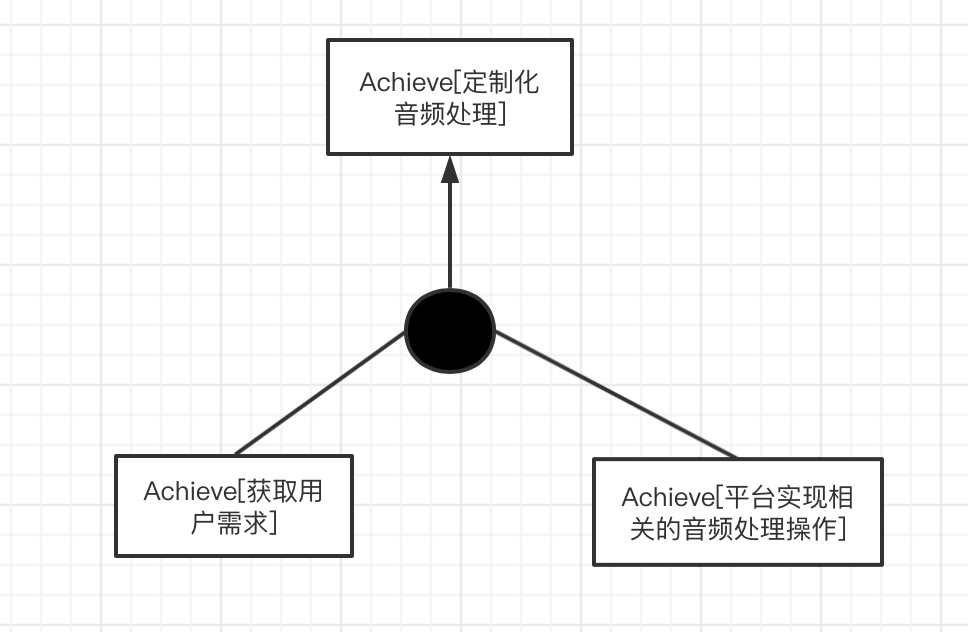

在进行用户需求获取的时候我们首先应该得知他已经十分确定的目标，这作为一个方面，同时，我们也应该从整个音频处理的结果来看，向其提供一些我们平台可以创新的目标作为用户需求的补充。

在平台实现这些操作的过程中，我们可以与某些音乐领域的专业人士合作，提供有用的建议的方法，以实现或添加创新的目标。同时我们会邀请一些用户来对定制化后的音频进行评价。

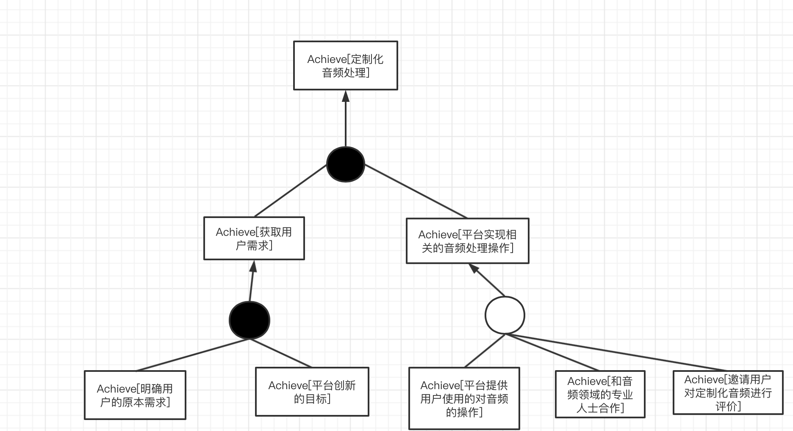

#### 3.1.2 目标冲突与协作

通过对目标的整体分析，我们识别出了其他的目标。在平台进行音频处理的时候，再减少成本这一观点上，我们应该简化处理的流程，但是这和我们原本的目标相冲突，我们应该以实现音频处理的目标为重，把这发展为我们的主要价值主张。同时，在获取用户需求后，我们可以借此研究当前用户的主要关注点在哪里，以便进行企业的下一步商业决策。

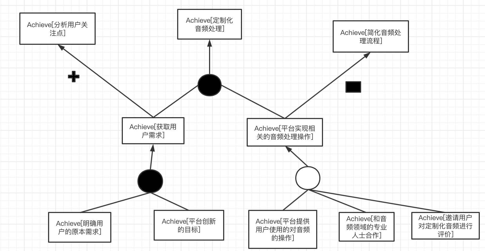

#### 3.1.3 目标实现

将底层目标分配给主体，结果如下图所示。负责和用户交流的人员和用户一起获取最基本的目标，然后再和音频领域的专业人士合作提出创新性的目标。定制化音频处理过程由音频领域的专业人士使用平台设施完成。完成过由一些用户进行评价。

将底层目标分配给不同操作，结果如下图所示。

### 3.2 音频推荐

#### 3.2.1 目标精化

要想实现音频推荐这一高层次目标，可以分为3个方面来考虑。一方面我们需要提取不同音频的特征，并且进行分析，然后当有新用户到来的时候，我们要对当前用户的信息进行提取，最后我们根据已有的信息，将对新用户的信息进行一些计算分析并且推荐一些可能比较喜欢的音频。

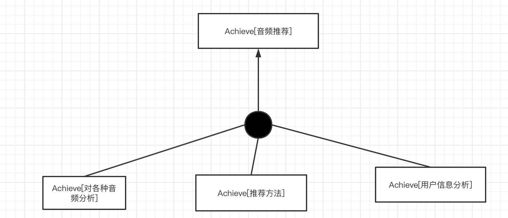

进一步，在对音频进行分析这一方面，我们可以先通过音频的种类来把它划分为不同的板块然后逐个推荐，比如原创，翻唱，配音，相声等。同时，我们也可以根据众多用户对音频的评价来对音频建立一个基础的认知。

在对推荐方法这一方面，用户可以通过我们平台提供的推荐算法获得可能会感兴趣的音频。

在用户信息分析方面，可以分为以下几个方面：此用户已收藏的音频，分析和此用户兴趣大致相同的其他用户还喜欢什么样的音频，此用户喜欢收听的音频。

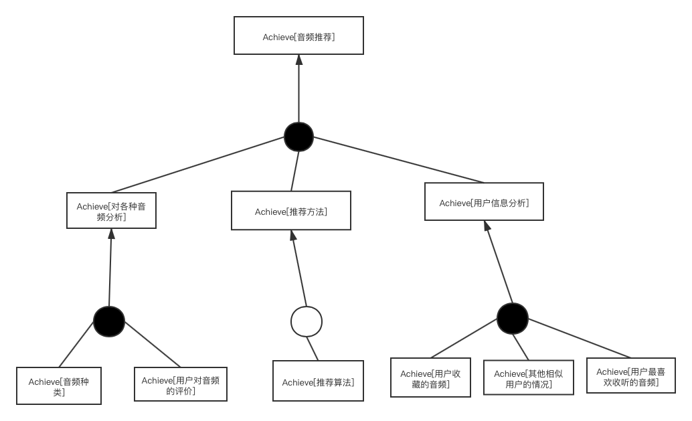

#### 3.2.2 目标冲突与协作

根据进一步对整体目标的分析，我们识别出了其他目标。在进行用户信息分析的时候，我们还可以给当前用户提供推荐有着相似收听习惯和兴趣的其他用户，这样可以促进用户间的交流，同时使我们平台保持活力，此目标和我们本来的目标呈协作关系。同时通过对各种音频的分析，我们还能找到热度最高的音频，这和我们本来的目标也呈协作关系。

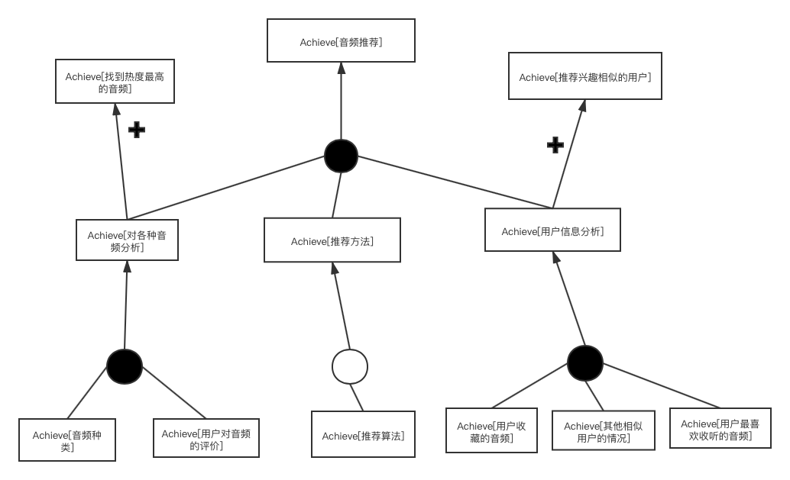

#### 3.2.3 目标实现

将底层的目标分配给主体，结果如下图所示。由开发人员进行推荐算法的开发。用户系统提供各种与用户相关的信息，成为各种用户信息分析的资源。信息管理人员负责监督并识别音频的种类，同时通过和用户系统的结合获取用户对音频的评价。

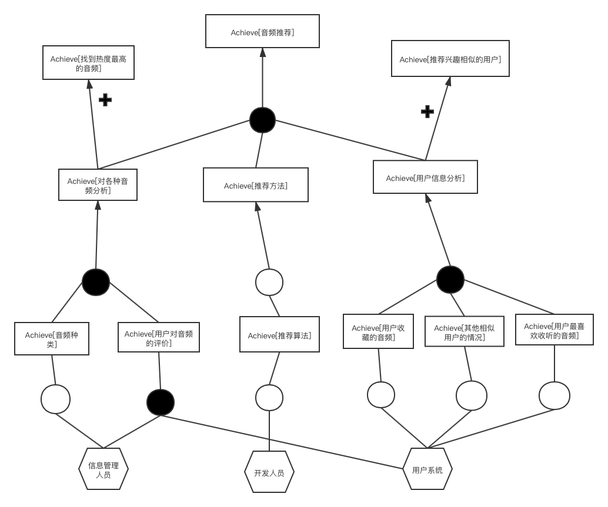

将底层目标分配给不同操作，结果如下图所示。

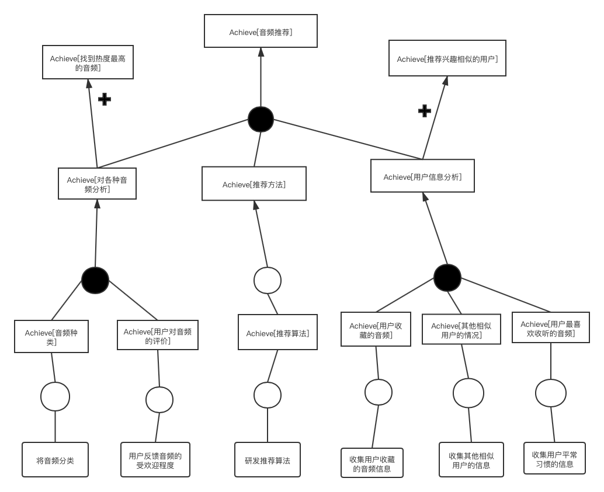

### 3.3 提供客制化音频服务

#### 3.3.1 目标精化

想要实现“提供客制化音频服务”这一高层目标，可以分为以下两个方面来考虑。首先，我们在用户阐述完他的需求，应该帮他联系到相关的音频制作人。然后再由我们平台和制作人合作一起完成客户想要的音频制作。

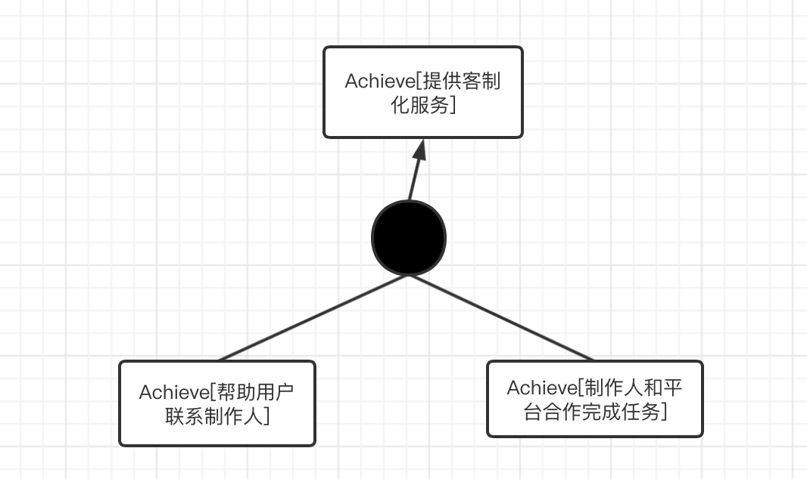

进一步，在联系制作人这一过程，我们还提供推荐相似的制作人的服务，以免有特殊的情况发生，如此制作人这段时间不方便，这给用户增加了更多的选择，同时提供了更多的商业机会。在制作人完成音频制作后，我们还应该进行一系列的监管审核措施。

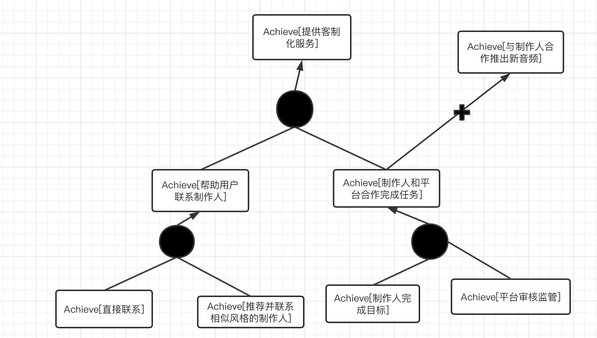

#### 3.3.2 目标冲突与协作

在对整体目标进行分析的同时，我们还发现了其他目标。我们和制作人合作这一方式，在客制化音频方面，我们的作用只是进行对最终音频的审核，但是我们还可以开展更深层次的业务，和制作人有更深层次的合作，而且面对的是所有的用户。

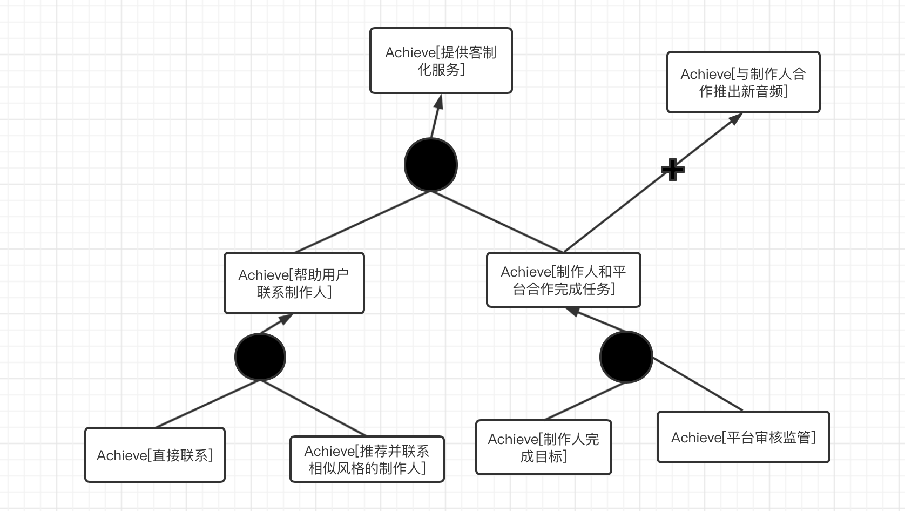

#### 3.3.3 目标实现

将底层目标分配给主体，结果如下图所示。由对接人员直接联系制作人，或者同时系统找到相似的制作人进行联系。制作人员完成任务后，由平台审核人员进行审核。

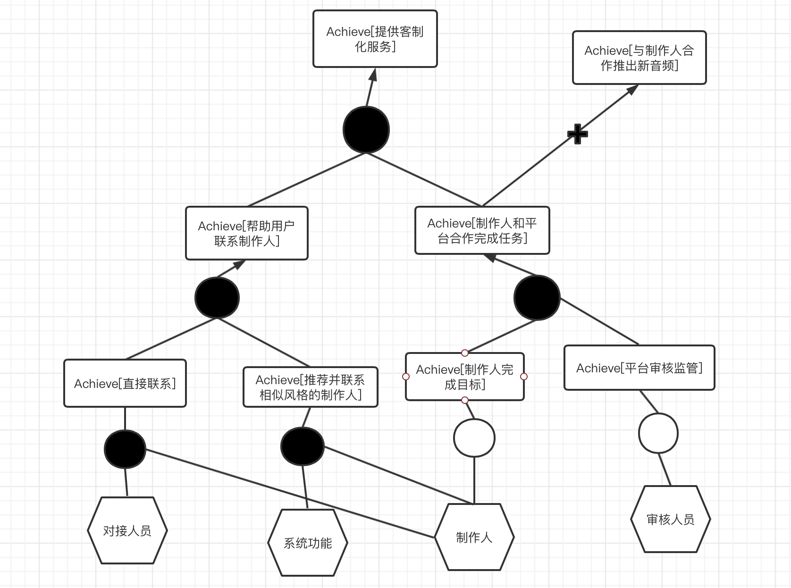

将底层目标分配给不同操作，结果如下图所示。

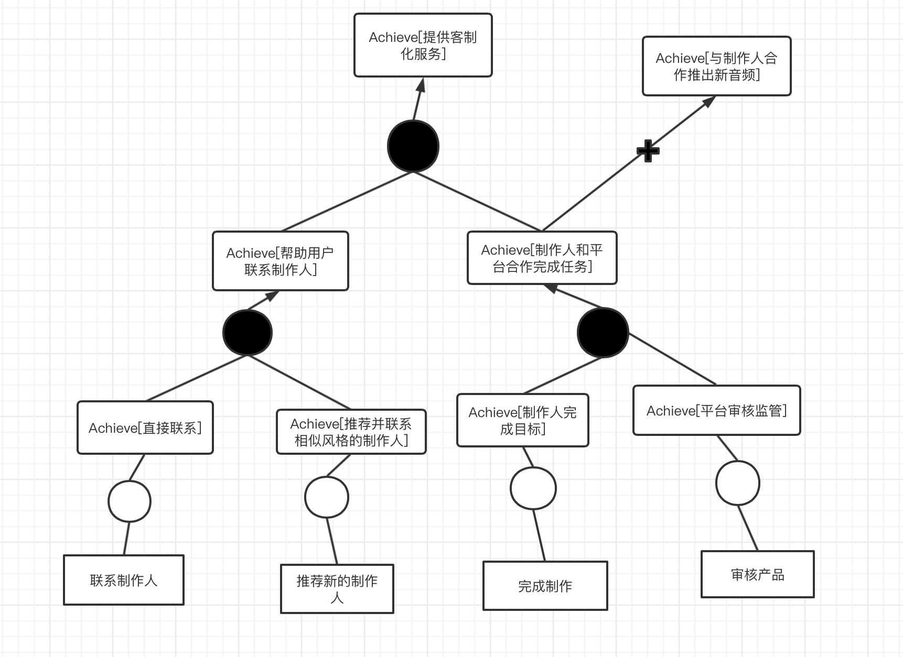

### 3.4 battle奖金赛

#### 3.4.1 目标精化

#### 3.4.2 目标冲突与协作

#### 3.4.3 目标实现

#### 

## 4.项目前景与范围

### 4.1本次需求开发迭代的商业模式部分

### 4.2业务需求

#### 4.2.1具体业务需求
p1：第一版应用之后的3个月内，曲库中的原创、版权、翻唱音源数量要超过10000。

p2：第一版应用之后的一年内，使用定制化音频修饰功能的用户及其潜在用户的数量要达到全体用户的40%，会员用户的80%。

P3：在系统使用6个月以内，平台邀请来的音频创作者、IP提供商数量达到千级。

P4：在系统使用一年之后，优秀的基于本平台的音频创作者数量应达到千级，所提供的音源播放频次达到总播放频次的50%。

P5：对于音频缺乏基于移动端的处理方案。

P6：一般音频分享社区缺乏用户数量。

p7: 系统使用一年后，用户数量达到百万级，会员比例达到20%。

p8: 系统每隔一年进行battle奖金赛，参赛用户数量达到百级，观赛用户达到用户总数量的40%。

#### 4.2.2提出业务需求的依据

### 4.3系统特性

#### 4.3.1具体系统特性

SF1：系统可对题目音频进行审核、筛选

SF2：系统从普通用户、主播、音频创作者、奖金赛参赛者等多渠道获取音频资源

SF3：系统实时更新音频资源库

SF4：系统对音频资源进行分类整合

SF5：系统可根据用户的音频制作等需求针对性的提供音频修饰方案和个性化服务

SF6：系统为会员用户提供声音测评、专业制作等高级服务功能

SF7：管理员对内容进行分类，来对社区内的经验分享进行整合。

SF8：系统根据用户平时的搜索记录，为用户推荐类似的音频或者用户

SF9：制定宣传手段，加大对本网站的宣传力度。

SF10：对相应的知名IP、业界大佬进行认证，并且入驻本平台。

SF11：系统提供在线直播平台，允许入驻的主播进行实时音频分享、录音分享。

SF12：系统允许管理人员对现有的音频进行分类、整合。

SF13：系统允许用户分享音频、评论音频。

SF14：系统允许用户（包括原创者与非原创者）对发表的音频进行二次创作（前提是双方同意）。

SF15：系统可以根据用户查询、制作音频记录进行个性化资源推荐。

SF16: 系统允许普通用户、音频创作者、专业IP商报名参加battle奖金赛。

SF17： 系统允许管理人员对battle奖金赛作品进行审核、分类。

SF18： 系统允许普通用户对battle奖金赛作品进行评价、投票。

SF19： 系统允许专业人员对battle奖金赛作品进行打分，并进行公布。

#### 4.3.2提出系统特性的依据

### 4.4问题用例图和系统用例图

### 4.5假设、依赖与限制

#### 4.5.1假设

|编号|假设内容|
|------|------|
|AS-1|用户拥有移动设备且可以连接互联网，具备一定的移动设备操作常识|
|AS-2|用户对他人创作的音频有一定的需求|
|AS-3|用户希望创造自己的音频，大部分用户对于音频修饰有需求|
|AS-4|普通用户进行音源分享创作时需要进行声明（原创还是转载），相关版权纠纷问题由用户自己负责|
|AS-5|大部分用户愿意进行音频分享|
|AS-6|大部分IP厂商愿意与平台合作，在平台上分享IP音源|
|AS-7|大部分音频创作者愿意参加battle奖金赛|

#### 4.5.2依赖

|编号|依赖内容|
|------|------|
|DE-1|需要租用云服务器提供商的服务器资源，比如阿里云、华为云……|
|DE-2|需要和第三方支付平台进行集成，可以双向通信和变更|
|DE-3|需要和第三方IP厂商进行合作，进行首批用户的吸引|

#### 4.5.3限制

|编号|限制内容|
|------|------|
|LI-1|本平台对于普通用户的自创音频暂时不进行人工审核|

### 4.6系统的操作环境

用户地理集中情况：用户在地理位置上具有明显的分散的特点

各类用户使用系统的时间状况：

|用户类别|使用时间状况|
|------|------|
|管理员|全天使用|
|普通用户|主要是在非工作时间，部分工作时间|
|主播|主要是在普通用户非工作时间，包括周末与工作日的早、晚|

数据的生成与使用情况：

|数据类型|生成出处|使用情况|
|------|------|------|

访问数据的最大响应时间： 3s

用户对服务中断的容忍度： 零容忍

是否需要提供安全控制和数据保护： 部分需要

### 4.7涉众分析

#### 4.7.1涉众识别的描述

#### 4.7.2涉众评估

|用户群体|任务|群体数量|优先级|
|------|------|------|------|
|管理员|负责平台整体的管理工作|30|2|
|普通用户|使用本平台进行音频收听、制作、分享等一系列活动|千万级|1|
|IP提供商|为平台提供IP吸引流量|几百家|4|
|音频创作者|基于平台进行音频创作并发布|万级|5|
|主播|基于平台进行音频直播|千级|7|
|程序员|搭建平台，提供核心音频定制化业务的实现，负责平台迭代|100|3|
|宣传人员|负责平台的宣传|千级|6|

## 5.面谈报告

### 5.1 第一次面谈报告
+ 会见者：胡海川 刘瑞麒 黄雨晨 陈思文
+ 被会见者：何文兵 柴绮 巫夷 赵睿豪
+ 会见地点：院楼406
+ 会见时间：2020.12.16 20：30——22：00
+ 主题：讨论平台的前景和业务机遇，平台的发展目标，和平台商业模式中存在的疑点等等
+ 会见目标：明确平台的发展前景和分处于不同发展阶段的重点

面谈概要  

 | 面谈要点 | 被会见者回答 |
 | ------- | -------- |
 | 1.平台存在收入支出的不平衡问题，请详细讲述资金链的流转。 |  产品初期阶段整体收入情况比较紧张，会采取缩减广告等费用的措施，|
 |   |重点在于推动用户规模增长；|
 |   |后期收益主要来源于会员制收费(去广告)，付费指导课程，渠道收费等。|
 | 2.平台提供了完整的业务流程，但请问最重要最核心的业务功能是其中的哪一环？|我们提供的业务服务重中之重是音频后期制作，|
 |   |整体流程是个人声音特点评测，推荐音频分享，定制化/智能化修音服务。|
 | 3.你们是如何吸引新用户入驻平台的？|早期采用UTC模式，以IP吸引并累计听众，后期转向GTC。|
 | 4.关于Battle奖金赛，你们设置这一环节的意义和目的是什么？|起到激励和宣传的效果，相比于事先录制处理的成品，这一环节更加富于现场气氛。|
 | 5.请列举几个你们认为最重要，最有潜力的合作商。|音频设备商(作为广告平台)；节目组/影视公司(签约歌手，艺人)。|
 | 6.产品前期如何快速启动并保证生存？|为了降低成本，减轻平台运载负荷，我们将采取轻资本的策略，具体表现为删除奖金赛，后期加入；削减IP设计。|
 | 7.如何看待并解决平台上存在的用户流失问题？|首先我们承认这一问题的存在，版权的所有属于个人一定会导致这个问题。|
 |   |站在解决问题的角度，平台主要通过提供外包制作服务和出版业务来缓解，这样能很大程度上留住优质艺人歌手和音频制作者。|
 | 8.平台的最大亮点是什么？|是移动端的音频处理。市面上的音频处理软件几乎没有移动端的，有也只是提供简单的音频初期处理功能，并不能很好的满足客户需要。|
 |   |另一方面，由于移动端的便捷性和实时性，这一需求的潜在用户量/市场其实是巨大的。|
 |   |我们提供独一无二的技术支持，不仅避免了同类产品的竞争并且产品本身前景广阔。|
 
 ### 5.2 第二次面谈报告
 + 会见者：胡海川 刘瑞麒 黄雨晨 陈思文
 + 被会见者：何文兵 柴绮 巫夷 赵睿豪
 + 会见地点：院楼406
 + 会见时间：2020.12.25 19：00——21：00
 + 主题：
 + 会见目标：
   1. 确认核实商业模式设计细节
   2. 商量关于原型图的设计
 
 ### 5.3 第三次面谈报告

## 6.用户需求文档

