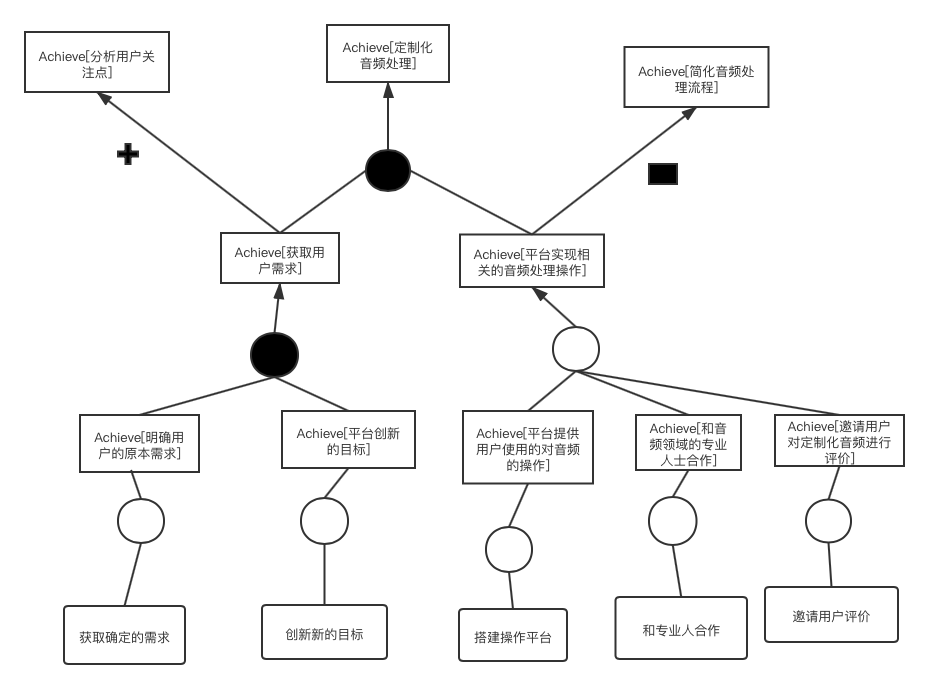
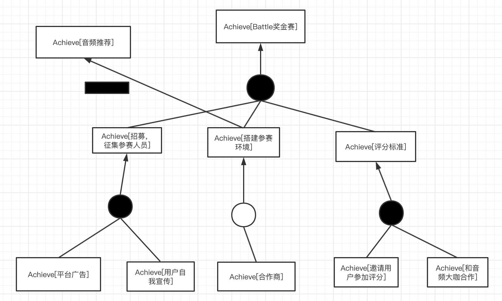
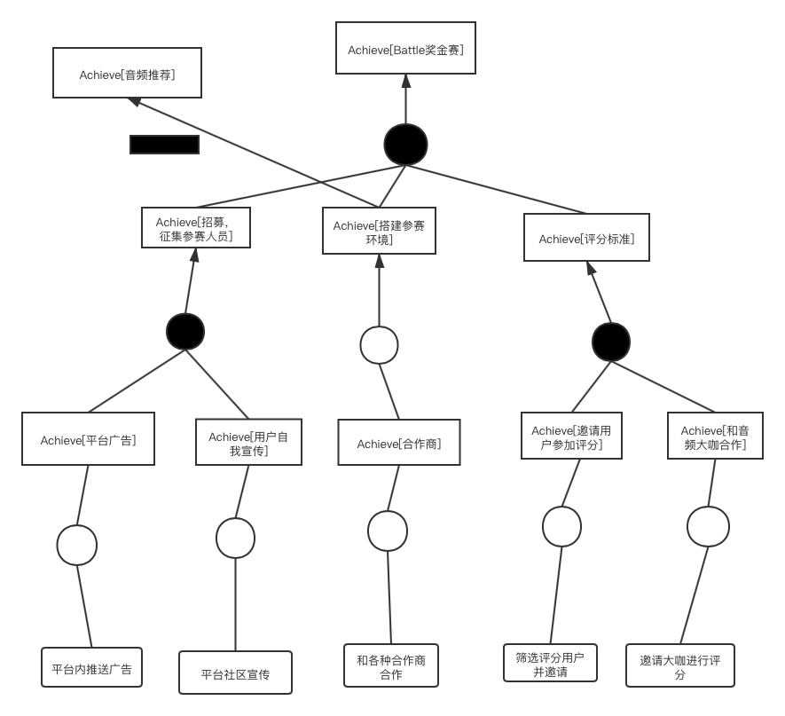

# 需求获取结果文档

[toc]

胡海川 181250046
刘瑞麒 181250087
黄雨晨 181250052
陈思文 181250013
2020年12月日

## 摘要

本项目为`零居里`小组为小组的项目所做的需求获取结果文档。

## 1.度量数值

## 2.需求获取安排计划书

### 2.1 第一次面谈安排

+ 会见者：胡海川 刘瑞麒 黄雨晨 陈思文
+ 被会见者：何文兵 柴绮 巫夷 赵睿豪
+ 预见会见地点：院楼406
+ 预见会见时间：2020.12.16
+ 面谈目的：明确平台的发展前景和分处于不同发展阶段的重点
+ 问题清单(开放式问题)：  
  1. 平台看起来有一定的入不敷出(收支不平衡)的问题，你们是怎么设计和解决的？
  2. 最核心的业务功能哪一个？
  3. 如何吸引新用户入驻平台？
  4. 请简略阐述Battle奖金赛的机制。
  5. 平台的合作商有哪些？
  6. 产品前期如何快速启动并保证生存？
  7. 如何看待并解决平台上存在的用户流失问题？
  8. 平台的最大亮点是什么？

### 2.2 第二次面谈安排
+ 会见者：胡海川 刘瑞麒 黄雨晨 陈思文
+ 被会见者：何文兵 柴绮 巫夷 赵睿豪
+ 预见会见地点：院楼406
+ 预见会见时间：2020.12.25
+ 面谈目的：
  1. 确认核实商业模式设计细节
  2. 商量关于原型图的设计
+ 问题清单(开放式与封闭式问题)：  
  甲方查看整体文档与商业模式设计构想是否有出入

### 2.3 第三次面谈安排

+ 会见者：胡海川、陈思文、黄雨晨、刘瑞麒
+ 被会见者：
+ 预计会见地点：
+ 面谈目的：
+ 问题清单：

## 3.目标模型分析

本节我们将从项目中抽取出高层次目标，一共分为以下四个板块：

+ 定制化音频处理
+ 音频推荐
+ 提供客制化音频服务
+ Battle奖金赛

以下分别讨论

### 3.1 定制化音频处理

#### 3.1.1 目标精化

对于“提供定制化音频处理的服务”这一高层次的目标，分析其AND关系下的子目标，可以分为以下2个目标。首先我们需要获取用户准确的音频处理需求，根据不同的需求我们有不同的应对措施。获取需求后交给我们平台进行较为专业的音频处理。

在进行用户需求获取的时候我们首先应该得知他已经十分确定的目标，这作为一个方面，同时，我们也应该从整个音频处理的结果来看，向其提供一些我们平台可以创新的目标作为用户需求的补充。

在平台实现这些操作的过程中，我们可以与某些音乐领域的专业人士合作，提供有用的建议的方法，以实现或添加创新的目标。同时我们会邀请一些用户来对定制化后的音频进行评价。初次之外，还可以选择用户自己定制自己想要的音频的服务，由用户通过我们平台上的操作，自己对音频进行一系列的编辑操作。

#### 3.1.2 目标冲突与协作

通过对目标的整体分析，我们识别出了其他的目标。在平台进行音频处理的时候，再减少成本这一观点上，我们应该简化处理的流程，但是这和我们原本的目标相冲突，我们应该以实现音频处理的目标为重，把这发展为我们的主要价值主张。同时，在获取用户需求后，我们可以借此研究当前用户的主要关注点在哪里，以便进行企业的下一步商业决策。

#### 3.1.3 目标实现

将底层目标分配给主体，结果如下图所示。负责和用户交流的人员和用户一起获取最基本的目标，然后再和音频领域的专业人士合作提出创新性的目标。定制化音频处理过程由音频领域的专业人士使用平台设施完成。完成后由一些用户进行评价。或者用户使用平台设施自己进行操作。

将底层目标分配给不同操作，结果如下图所示。

### 3.2 音频推荐

#### 3.2.1 目标精化

要想实现音频推荐这一高层次目标，可以分为3个方面来考虑。一方面我们需要提取不同音频的特征，并且进行分析，然后当有新用户到来的时候，我们要对当前用户的信息进行提取，最后我们根据已有的信息，将对新用户的信息进行一些计算分析并且推荐一些可能比较喜欢的音频。

进一步，在对音频进行分析这一方面，我们可以先通过音频的种类来把它划分为不同的板块然后逐个推荐，比如原创，翻唱，配音，相声等。同时，我们也可以根据众多用户对音频的评价来对音频建立一个基础的认知。

在对推荐方法这一方面，用户可以通过我们平台提供的推荐算法获得可能会感兴趣的音频。

在用户信息分析方面，可以分为以下几个方面：此用户已收藏的音频，分析和此用户兴趣大致相同的其他用户还喜欢什么样的音频，此用户喜欢收听的音频。

#### 3.2.2 目标冲突与协作

根据进一步对整体目标的分析，我们识别出了其他目标。在进行用户信息分析的时候，我们还可以给当前用户提供推荐有着相似收听习惯和兴趣的其他用户，这样可以促进用户间的交流，同时使我们平台保持活力，此目标和我们本来的目标呈协作关系。同时通过对各种音频的分析，我们还能找到热度最高的音频，这和我们本来的目标也呈协作关系。

#### 3.2.3 目标实现

将底层的目标分配给主体，结果如下图所示。由开发人员进行推荐算法的开发。用户系统提供各种与用户相关的信息，成为各种用户信息分析的资源。信息管理人员负责监督并识别音频的种类，同时通过和用户系统的结合获取用户对音频的评价。

将底层目标分配给不同操作，结果如下图所示。

### 3.3 提供客制化音频服务

#### 3.3.1 目标精化

想要实现“提供客制化音频服务”这一高层目标，可以分为以下两个方面来考虑。首先，我们在用户阐述完他的需求，应该帮他联系到相关的音频制作人。然后再由我们平台和制作人合作一起完成客户想要的音频制作。

进一步，在联系制作人这一过程，我们还提供推荐相似的制作人的服务，以免有特殊的情况发生，如此制作人这段时间不方便，这给用户增加了更多的选择，同时提供了更多的商业机会。在制作人完成音频制作后，我们还应该进行一系列的监管审核措施。

#### 3.3.2 目标冲突与协作

在对整体目标进行分析的同时，我们还发现了其他目标。我们和制作人合作这一方式，在客制化音频方面，我们的作用只是进行对最终音频的审核，但是我们还可以开展更深层次的业务，和制作人有更深层次的合作，而且面对的是所有的用户。

#### 3.3.3 目标实现

将底层目标分配给主体，结果如下图所示。由对接人员直接联系制作人，或者同时系统找到相似的制作人进行联系。制作人员完成任务后，由平台审核人员进行审核。

将底层目标分配给不同操作，结果如下图所示。

### 3.4 Battle奖金赛

#### 3.4.1 目标精化

想要实现Battle奖金赛这一高层目标，可以分为以下三个目标。首先平台应该通过多方渠道发布信息，宣传Battle奖金赛，这样才能获得足够的参赛人员和观看人员。其次应该搭建好参赛的环境，选择好合作的对象。最后，应该有多种多样的评分标准，给奖金赛一个完美的结果。

进一步：

我们主要通过平台的广告来宣传奖金赛的信息，同时让这个消息在用户之间发酵，从而征集更多的有意愿的参赛人员。

为了搭建参赛的环境，我们会和各种合作商合作，可能包括广告、场地、设备等合作商。

对于最后的评分，为了公平性，我们会邀请各种的音频大咖来参与，这是评分的一个重要来源，同时，也会选择部分用户来参加评分，增加大众的成本在评分里。

#### 3.4.2 目标冲突与协作

在对整体目标进行分析的同时，我们还发现了其他目标。音频推荐这一主要业务是我们在前期以低成本获得高流量和占据市场的主打产品，但是奖金赛在环境搭建的时候，需要和各种各样的合作商合作，这需要大量的资金，和上述的目标产生了冲突。所以，我们选择在后期开展奖金赛这一目标，把它当作进一步产品推广和业务创造的途径。

#### 3.4.3 目标实现

将底层目标分配给主体，结果如下图所示。平台系统推出广告，同时利用平台社区让消息在用户之间传递，并且筛选出最后可以参加评分的用户。总经理主要负责和各种合作商的合作业务。业务对接人员负责和音频大咖联系，并邀请其参加最后的评分。

将底层目标分配给不同操作，结果如下图所示。

## 4.项目前景与范围

### 4.1本次需求开发迭代的商业模式部分

本次需求开发结合了甲方的商业模式画布和面谈讨论结果，覆盖了甲方个四最核心的需求——定制化音频处理、音频推荐、提供客制化音频服务和Battle奖金赛，整体上，我们这次设计包含了甲方大部分的商业模式部分，但由于第一次迭代，在甲方一些细节功能的要求上，可能达不到全覆盖。我们初步保守估算本次设计可以覆盖到甲方至少70%的商业模式要点。

具体说明（对应于甲方的画布图）：

客户细分：覆盖到听众、主播、音频创作者、参赛者和IP提供商；

客户关系：覆盖到社区、与客户协作、自动化服务、私人服务；未覆盖：共同创造；

渠道通路：覆盖到各大应用市场、音频设备商、IP提供商，自身强渠道；

价值主张：覆盖到音频社区交流平台、大众娱乐、多元化音频分享、智能化音频后期处理、定制化音频处理、客制化音频、爱好者竞争；未覆盖：挖掘独特声音、专业制作与发行、知识付费；

成本结构：覆盖到版权费用、主播签约费、开发运维费用、人力成本、平台宣传推广费用、IP提供商的长期合作费用；未覆盖：用户创作激励、综艺节目合作费用、付费课程录制费、外包费用；

收入来源：覆盖到设备商广告费用、会员费、礼物打赏抽成、定制化专业处理业务、客制化音频抽成、battle奖金赛入场门票；未覆盖：声乐课程售卖、原创作品发行后的收入抽成；

关键业务：覆盖到音频推荐、声音测评、音频处理、客制化音频购买、battle奖金赛；未覆盖用户PK、原创制作与发行；

核心资源：覆盖IP版权、智能音频处理、声音特征分析算法、UGC音频版权、运维人员、软件工程师、监督团队；未覆盖声乐课录播、专业制作人；

重要伙伴：覆盖音频设备商、IP提供商、唱片公司；未覆盖音乐综艺节目组、影视公司、音乐学院的声乐老师和配音老师；

### 4.2业务需求

#### 4.2.1具体业务需求
p1：第一版应用之后的3个月内，曲库中的原创、版权、翻唱音源数量要超过50000。

p2：第一版应用之后的一年内，使用定制化音频修饰功能的用户及其潜在用户的数量要达到全体用户的40%，会员用户的80%。

P3：在系统使用6个月以内，平台邀请来的音频创作者、IP提供商数量达到千级。

P4：在系统使用一年之后，优秀的基于本平台的音频创作者数量应达到千级，所提供的音源播放频次达到总播放频次的50%。

P5：对于音频缺乏基于移动端的处理方案。

P6：一般音频分享社区缺乏用户数量。

p7: 系统每隔一年进行battle奖金赛，参赛用户数量达到百级，观赛用户达到用户总数量的40%。

#### 4.2.2提出业务需求的依据

|要素|内容|
|------|------|
|ID|P1|
|提出者|使用平台进行音频收听的听众|
|关联者|音频创作者，IP提供商|
|问题|现如今市面上对于自制音频，包括配音、翻唱等音频资源缺乏一个成熟的分享创作平台，且存在着部分领域资源短缺的问题|
|影响|用户需要通过其他渠道收集需要的音频资源，自行整合，导致耗费大量的时间和精力；在一部分领域，版权无法得到有效的保证|
|目标|第一版应用之后的3个月内，曲库中的原创、版权、翻唱音源数量要超过50000。|

|要素|内容|
|------|------|
|ID|P2|
|提出者|Voice Sharing项目经理|
|关联者|使用平台进行音频收听、创作的用户|
|问题|现有音频分享平台用户分散程度高|
|影响|用户流量小，导致平台收入少|
|目标|第一版应用之后的一年内，使用定制化音频修饰功能的用户及其潜在用户的数量要达到全体用户的40%，会员用户的80%。|

|要素|内容|
|------|------|
|ID|P3|
|提出者|Voice Sharing项目经理|
|关联者|使用平台进行音频收听、创作的用户，主播，IP提供商|
|问题|现如今音乐平台往往难以拿到正版IP|
|影响|项目启动难以吸引第一批客户|
|目标|在系统使用6个月以内，平台邀请来的音频创作者、IP提供商数量达到千级。|

|要素|内容|
|------|------|
|ID|P4|
|提出者|Voice Sharing项目经理|
|关联者|使用平台进行音频收听的用户，音频创作者|
|问题|部分用户不愿意进行音频分享，部分音频创作者的作品难以得到赏识|
|影响|打消音频创作者积极性，影响平台氛围|
|目标|在系统使用一年之后，优秀的基于本平台的音频创作者数量应达到千级，所提供的音源播放频次达到总播放频次的50%。|

|要素|内容|
|------|------|
|ID|P5|
|提出者|使用平台进行音频收听、创作的用户|
|关联者|Voice Sharing项目经理，项目负责程序员|
|问题|目前市面上对于音频缺乏基于移动端的处理方案。|
|影响|部分希望处理自己创作的音频的用户需求得不到满足|
|目标|平台提供定制化音频处理、客制化音频服务|

|要素|内容|
|------|------|
|ID|P6|
|提出者|Voice Sharing项目经理|
|关联者|使用平台进行音频收听、创作的用户，平台宣传人员|
|问题|一般音频分享社区缺乏用户数量。|
|影响|平台难以盈利|
|目标|通过预先购买的IP吸引第一批客户，逐渐发展壮大|

|要素|内容|
|------|------|
|ID|P7|
|提出者|Voice Sharing项目经理|
|关联者|使用平台进行音频收听、创作的用户，IP提供商|
|问题|用户创作音频缺少激励|
|影响|用户热情下降|
|目标|系统每隔一年进行battle奖金赛，参赛用户数量达到百级，观赛用户达到用户总数量的40%。|

### 4.3系统特性

#### 4.3.1具体系统特性

SF1：系统可对题目音频进行审核、筛选

SF2：系统从普通用户、主播、音频创作者、奖金赛参赛者等多渠道获取音频资源

SF3：系统实时更新音频资源库

SF4：系统对音频资源进行分类整合

SF5：系统可根据用户的音频制作等需求针对性的提供音频修饰方案和个性化服务

SF6：系统为会员用户提供声音测评、专业制作等高级服务功能

SF7：管理员对内容进行分类，来对社区内的经验分享进行整合。

SF8：系统根据用户平时的搜索记录，为用户推荐类似的音频或者用户

SF9：制定宣传手段，加大对本网站的宣传力度。

SF10：对相应的知名IP、业界大佬进行认证，并且入驻本平台。

SF11：系统提供在线直播平台，允许入驻的主播进行实时音频分享、录音分享。

SF12：系统允许管理人员对现有的音频进行分类、整合。

SF13：系统允许用户进行定制化音频处理、享有客制化音频服务。

SF14：系统允许用户分享音频、评论音频。

SF15：系统允许用户（包括原创者与非原创者）对发表的音频进行二次创作（前提是双方同意）。

SF16：系统可以根据用户查询、制作音频记录进行个性化资源推荐。

SF17: 系统允许普通用户、音频创作者、专业IP商报名参加battle奖金赛。

SF18： 系统允许管理人员对battle奖金赛作品进行审核、分类。

SF19： 系统允许普通用户对battle奖金赛作品进行评价、投票。

SF20： 系统允许专业人员对battle奖金赛作品进行打分，并进行公布。

#### 4.3.2提出系统特性的依据

首先，我们经过小组讨论和与客户面谈，对每一个明确一致的问题都确定了一致的解决方案，在选定解决方案之后，我们进一步明确了该解决方案需要具备的功能特征，即系统特性：

|系统特征编号|针对的问题|解决方案需要具备的系统特征|
|------|------|------|
|SF1|P1|系统可对题目音频进行审核、筛选|
|SF2|P1|系统从普通用户、主播、音频创作者、奖金赛参赛者等多渠道获取音频资源|
|SF3|P1|系统实时更新音频资源库|
|SF4|P1|系统对音频资源进行分类整合|
|SF5|P2|系统可根据用户的音频制作等需求针对性的提供音频修饰方案和个性化服务|
|SF6|P2|系统为会员用户提供声音测评、专业制作等高级服务功能|
|SF7|P3|管理员对内容进行分类，来对社区内的经验分享进行整合。|
|SF8|P4|系统根据用户平时的搜索记录，为用户推荐类似的音频或者用户。|
|SF9|P4|制定宣传手段，加大对本网站的宣传力度。|
|SF10|P4|对相应的知名IP、业界大佬进行认证，并且入驻本平台。|
|SF11|P4|系统提供在线直播平台，允许入驻的主播进行实时音频分享、录音分享。|
|SF12|P5|系统允许管理人员对现有的音频进行分类、整合。|
|SF13|P5|系统允许用户进行定制化音频处理、享有客制化音频服务|
|SF14|P2|系统允许用户分享音频、评论音频。|
|SF15|P5|系统允许用户（包括原创者与非原创者）对发表的音频进行二次创作（前提是双方同意）。|
|SF16|P6|系统可以根据用户查询、制作音频记录进行个性化资源推荐。|
|SF17|P7|系统允许普通用户、音频创作者、专业IP商报名参加battle奖金赛。|
|SF18|P7| 系统允许管理人员对battle奖金赛作品进行审核、分类。|
|SF19|P7| 系统允许普通用户对battle奖金赛作品进行评价、投票。|
|SF20|P7| 系统允许专业人员对battle奖金赛作品进行打分，并进行公布。|

### 4.4系统用例图

### 4.5假设、依赖与限制

#### 4.5.1假设

|编号|假设内容|
|------|------|
|AS-1|用户拥有移动设备且可以连接互联网，具备一定的移动设备操作常识|
|AS-2|用户对他人创作的音频有一定的需求|
|AS-3|用户希望创造自己的音频，大部分用户对于音频修饰有需求|
|AS-4|普通用户进行音源分享创作时需要进行声明（原创还是转载），相关版权纠纷问题由用户自己负责|
|AS-5|大部分用户愿意进行音频分享|
|AS-6|大部分IP厂商愿意与平台合作，在平台上分享IP音源|
|AS-7|大部分音频创作者愿意参加battle奖金赛|

#### 4.5.2依赖

|编号|依赖内容|
|------|------|
|DE-1|需要租用云服务器提供商的服务器资源，比如阿里云、华为云……|
|DE-2|需要和第三方支付平台进行集成，可以双向通信和变更|
|DE-3|需要和第三方IP厂商进行合作，进行首批用户的吸引|

#### 4.5.3限制

|编号|限制内容|
|------|------|
|LI-1|本平台对于普通用户的自创音频暂时不进行人工审核|

### 4.6系统的操作环境

用户地理集中情况：用户在地理位置上具有明显的分散的特点

各类用户使用系统的时间状况：

|用户类别|使用时间状况|
|------|------|
|管理员|全天使用|
|普通用户|主要是在非工作时间，部分工作时间|
|主播|主要是在普通用户非工作时间，包括周末与工作日的早、晚|

数据的生成与使用情况：

|数据类型|生成出处|使用情况|
|------|------|------|
|自创音频文件|当用户进行音频创作时产生|发布前可以进行收听和更改，发布后可以进行评论、评价和再次修改，在用户和创作者达成一致的情况下可以进行二次创作|
|自创音频文件分析|当用户进行音频创作时产生|主要用于系统提供的定制化服务|
|IP商作品资料|主要由管理员录入系统|提供给普通用户与会员用户进行欣赏与二次创作|
|用户资料|主要由用户自行填写，也可由系统从用户的历史听歌数据中获取|用于分析用户情况，为用户做出个性化的音频推荐|
|评价资源|有用户进行评价评论时产生|主要用于推荐到主页的作品的筛选|
|奖金赛评分|由battle奖金赛评委和听众反馈产生|用于推选出battle奖金赛的排名|

访问数据的最大响应时间： 3s

用户对服务中断的容忍度： 零容忍

是否需要提供安全控制和数据保护： 部分需要

### 4.7涉众分析

#### 4.7.1涉众识别的描述

|涉众|特征|主要目标|态度|主要关注点|约束条件|
|------|------|------|------|---|---|
|管理员|在定制化音频处理方面，管理员负责音频处理机制的反馈获取，对产生的音频进行分类整合 在音频推荐方面，管理员对音频库进行管理，保证其正常运行，要对部分音频进行审核工作，并定期更新曲库 在提供客制化音频服务方面，管理员负责管理联系着客户和提供客制化服务的音频创作者的平台，保持交流正常进行 在Battle奖金赛方面，管理员负责保证赛事的正常举办|对用户自创的音频进行分类，依据用户所爱类型进行推荐，提高用户满意度；对新录入的音频进行审核；定期进行曲库更新；定期举行battle奖金赛|比较支持，但对于审核、整合、分类等工作的复杂度怀有担忧态度|保证审核和分类整合的有效性、便捷性，合并要尽可能简单。|必须是平台内部人员，使用系统前要进行培训|
|普通用户（听众）|普通听众可以享受平台提供的定制化音频处理，进行个人的音频录制； 同时享受推荐系统带来的便利进行音频欣赏；有喜欢的音频创造者可以申请客制化服务；可以直接参加battle奖金赛也可以作为大众评审进行投票|享受平台带来的服务|强烈支持|保证进行的音频创作或客制化服务申请内容是合法合规的|需要提供部分个人资料，在平台进行注册和登录，需要认证身份的真实性和有效性|
|IP提供商|IP提供商入驻后可以借由平台去接触粉丝，收听他们的意见同时为粉丝们提供一些官方的音频作品|宣传本公司的IP|比较支持，但是对合作费有一定的要求|平台能否拥有足够的用户达到宣传、盈利的目标|需要对版权使用问题签订相关协议|
|音频创作者|创作者在创作前可以通过测评找到最适合自己的作品，挖掘独特声音，创作后既可以通过智能化音频处理系统，简易而高效地处理音频，也可以人工定制服务，进行定制化音频处理。 创作者可以在此上传自己的音频，而收听者可以通过点赞，评论，打赏，转发支持创作者。创作者可以提供客制化的音频，在进一步鼓励知识付费的同时，为创作者提供灵感，为听众提供全面定制的音频。|在享受平台带来的定制化服务进行创作的同时提供客制化的音频，实现个人的盈利|比较支持，但对于平台收取的中间费有担忧|保证进行的音频创作内容是合法合规的|可以是普通听众，也可以是专业的配音演员或歌手|
|主播|给其他听众在线的音频服务和优质的作品|通过直播和提供客制化服务获得盈利|比较支持，但是对于平台提成有所担忧|保证进行的直播内容是合法合规的|需要提供部分个人资料，在平台进行注册和登录，需要认证身份的真实性和有效性|
|宣传人员|负责网站的宣传工作，进行宣传网站以及邀请一些业界大佬入驻到Voice Sharing平台|提高网站的知名度，从而吸引更多用户。|强烈支持|邀请业界大佬的费用、宣传的费用要保证合理性|需要拥有一定的人脉以及宣传经验|

#### 4.7.2涉众评估

|用户群体|任务|群体数量|优先级|
|------|------|------|------|
|管理员|负责平台整体的管理工作|30|4|
|普通用户|使用本平台进行音频收听、制作、分享等一系列活动|千万级|1|
|IP提供商|为平台提供IP吸引流量|几百家|2|
|音频创作者|基于平台进行音频创作并发布|万级|3|
|主播|基于平台进行音频直播|千级|6|
|宣传人员|负责平台的宣传|千级|5|

## 5.面谈报告

### 5.1 第一次面谈报告
+ 会见者：胡海川 刘瑞麒 黄雨晨 陈思文
+ 被会见者：何文兵 柴绮 巫夷 赵睿豪
+ 会见地点：院楼406
+ 会见时间：2020.12.16 20：30——22：00
+ 主题：讨论平台的前景和业务机遇，平台的发展目标，和平台商业模式中存在的疑点等等
+ 会见目标：明确平台的发展前景和分处于不同发展阶段的重点

面谈概要  

| 面谈要点 | 被会见者回答 |
| ------- | -------- |
| 1.平台存在收入支出的不平衡问题，请详细讲述资金链的流转。 |  产品初期阶段整体收入情况比较紧张，会采取缩减广告等费用的措施，|
|   |重点在于推动用户规模增长；|
|   |后期收益主要来源于会员制收费(去广告)，付费指导课程，渠道收费等。|
| 2.平台提供了完整的业务流程，但请问最重要最核心的业务功能是其中的哪一环？|我们提供的业务服务重中之重是音频后期制作，|
|   |整体流程是个人声音特点评测，推荐音频分享，定制化/智能化修音服务。|
| 3.你们是如何吸引新用户入驻平台的？|早期采用UTC模式，以IP吸引并累计听众，后期转向GTC。|
| 4.关于Battle奖金赛，你们设置这一环节的意义和目的是什么？|起到激励和宣传的效果，相比于事先录制处理的成品，这一环节更加富于现场气氛。|
| 5.请列举几个你们认为最重要，最有潜力的合作商。|音频设备商(作为广告平台)；节目组/影视公司(签约歌手，艺人)。|
| 6.产品前期如何快速启动并保证生存？|为了降低成本，减轻平台运载负荷，我们将采取轻资本的策略，具体表现为删除奖金赛，后期加入；削减IP设计。|
| 7.如何看待并解决平台上存在的用户流失问题？|首先我们承认这一问题的存在，版权的所有属于个人一定会导致这个问题。|
|   |站在解决问题的角度，平台主要通过提供外包制作服务和出版业务来缓解，这样能很大程度上留住优质艺人歌手和音频制作者。|
| 8.平台的最大亮点是什么？|是移动端的音频处理。市面上的音频处理软件几乎没有移动端的，有也只是提供简单的音频初期处理功能，并不能很好的满足客户需要。|
|   |另一方面，由于移动端的便捷性和实时性，这一需求的潜在用户量/市场其实是巨大的。|
|   |我们提供独一无二的技术支持，不仅避免了同类产品的竞争并且产品本身前景广阔。|

 ### 5.2 第二次面谈报告
 + 会见者：胡海川 刘瑞麒 黄雨晨 陈思文
 + 被会见者：何文兵 柴绮 巫夷 赵睿豪
 + 会见地点：院楼406
 + 会见时间：2020.12.25 19：00——21：00
 + 主题：审核用例图和原型图
 + 会见目标：
   1. 确认核实商业模式设计细节
   2. 商量关于原型图的设计

面谈概要  

| 面谈要点 | 被会见者建议 |
| ------- | -------- |
|用例图|将定制化拆分成音频自处理和平台处理|
|用例图|添加录制用例，播放收藏打赏等功能|
|用例图|添加下载功能(考虑到版权的问题)|
|用例图|ip接入改成ip认证 |
|用例图|添加作品管理功能(存为草稿，发布)|
|用例图|添加battle奖金赛功能:收听，投稿|
|原型图|主页大幅改动，添加播放页面|
|原型图|音频分类页面局部改动|
|原型图|音频处理页面局部改动|
|原型图|搜索页面小幅改动|
|原型图|battle奖金赛页面局部改动|

原型讨论

用户极不满意，提出以下批评：
1. 卡片式播放和设想不同，设想是主页面选择标签。
2. 点击进入后类似抖音界面，具有自动切换，点赞收藏打赏功能按键。
3. 添加播放界面。  

如图所示，为新添加的音频播放页面，具有具有自动切换，点赞收藏打赏功能按键。

用户比较满意，提出以下建议：
1. 不要混淆种类和分类的区别，种类：如歌曲具有不同的种类(欧美，华语)。

用户比较满意，提出以下建议：
1. 去除掉播放区域。
2. 添加拖动式属性修改。
3. 工具箱具体描述。

用户比较满意，提出以下建议：
1. 将格式修改为种类。

用户比较满意，提出以下建议：
1. 对参赛作品添加内容介绍。
2. 在底部的"我要报名"处添加具体的信息填报。

 ### 5.3 第三次面谈报告

## 6.用户需求文档

### 项目背景

### 详细用例描述

我们针对甲方意图提供给用户的核心业务，即音频推荐、智能音频处理、等，抽取出如下详细用户用例。

| ID       | 0                                                            |
| -------- | ------------------------------------------------------------ |
| 名称     | 播放音乐                                                     |
| 优先级   | 高                                                           |
| 参与者   | 听众，目标为听歌                                             |
| 触发条件 | 无                                                           |
| 前置条件 | 用户选中特定音乐                                             |
| 后置条件 | 根据用户的历史偏好信息，播放下一首音乐                       |
| 正常流程 | 1.用户选择播放 2.音乐按常速率进行播放 3.播放完成，根据当前模式（单曲循环，列表连续，随机播放）进行下一步 |
| 拓展业务 | 2.a 用户根据对音乐的观感显式提供反馈（用例2） 2.b 用户获取音乐相关信息（歌词，作者，所属专辑） |
| 业务规则 | 无                                                           |
| 特殊需求 | 无                                                           |

| ID       | 1                                                            |
| -------- | ------------------------------------------------------------ |
| 名称     | 获取推荐                                                     |
| 优先级   | 高                                                           |
| 参与者   | 听众，目标为得到下一首符合喜好的音乐                         |
| 触发条件 | 无                                                           |
| 前置条件 | 用户要求音乐推送                                             |
| 后置条件 | 根据用户的历史偏好信息，播放下一首音乐                       |
| 正常流程 | 1.用户进入音乐推送模块 2.用户要求推送新的音乐 3.系统返回推荐结果 |
| 拓展业务 | 3.a 用户可进入播放（用例0）或再次要求推荐                    |
| 业务规则 | 无                                                           |
| 特殊需求 | 获取推荐操作应简单直接。                                     |

| ID       | 2                                                            |
| -------- | ------------------------------------------------------------ |
| 名称     | 评价音频                                                     |
| 优先级   | 高                                                           |
| 参与者   | 听众，目标为表达自己对某音频的评价                           |
| 触发条件 | 无                                                           |
| 前置条件 | 用户选择发起评价                                             |
| 后置条件 | 用户评论完成，更新音频的评价信息，更新用户的评价历史与偏好信息 |
| 正常流程 | 1.用户从对应音频播放界面跳转至评价界面 2.用户填写评价信息（评分/原因） 3.用户提交评价表单，返回音频播放界面 |
| 拓展业务 | 1.a 用户可浏览其他用户的公开评价 2.a 在用户给予高评价时，显示点赞与打赏选项 |
| 业务规则 | 无                                                           |
| 特殊需求 | 无                                                           |

| ID       | 3                                                            |
| -------- | ------------------------------------------------------------ |
| 名称     | 嗓音分析                                                     |
| 优先级   | 高                                                           |
| 参与者   | 音频提供者，目标为获取声音分析结果并根据分析改善音频。       |
| 触发条件 | 无                                                           |
| 前置条件 | 用户提供声音样本                                             |
| 后置条件 | 反馈声音分析结果，更新用户音色信息                           |
| 正常流程 | 1.用户启动录制提供可分析音频 2.系统对音频进行分析并反馈结果 |
| 拓展业务 | 1.a 用户可选择从本地媒体库中上传音频 2.a 用户可选择保存或分享分析报告 |
| 业务规则 | 无                                                           |
| 特殊需求 | 无                                                           |

| ID       | 4                                                            |
| -------- | ------------------------------------------------------------ |
| 名称     | 智能调音                                                     |
| 优先级   | 高                                                           |
| 参与者   | 普通用户与音频提供者，目标为提供音频质量                     |
| 触发条件 | 无                                                           |
| 前置条件 | 用户提供需调音音频                                           |
| 后置条件 | 系统返回智能调音后音频                                       |
| 正常流程 | 1.用户上传需调整音频 2.用户根据需要设置调音选项与参数 3.系统处理音频并返回 4.用户试听音频 5.用户保存音频 |
| 拓展业务 | 1.a 用户可选择从本地媒体库中上传音频                         |
| 业务规则 | 无                                                           |
| 特殊需求 | 智能调音功能需参考用户音色信息以提供最佳效果                 |

| ID       | 5                                                            |
| -------- | ------------------------------------------------------------ |
| 名称     | 手动调音                                                     |
| 优先级   | 高                                                           |
| 参与者   | 音频提供者，目标为打造专业级的音频作品                       |
| 触发条件 | 无                                                           |
| 前置条件 | 用户切换至手动调音模式                                       |
| 后置条件 | 返回用户手动调音的结果音频                                   |
| 正常流程 | 1.用户进入手动调音界面 2.用户调节各类别调音参数 3.系统处理音频并返回 4.用户试听音频 5.用户保存音频 |
| 拓展业务 | 1.a 用户可选择从本地媒体库中上传音频 2.a 用户可自定义调音方案并保存，用于一键调音  4.a 在不满意的情况下，用户可选择从直接任一次处理结果处重新开始 5.a 用户可选择直接发布音频（用例6） |
| 业务规则 | 无                                                           |
| 特殊需求 | 手动调音界面为专业用户提供较智能修音更高的自由度与上限       |

| ID       | 6                                                            |
| -------- | ------------------------------------------------------------ |
| 名称     | 音频发布                                                     |
| 优先级   | 高                                                           |
| 参与者   | 音频提供者，目标为发布音频并从中获取收益                     |
| 触发条件 | 无                                                           |
| 前置条件 | 用户提供可发布音频                                           |
| 后置条件 | 音频进入公开音频库，更新发布者信息                           |
| 正常流程 | 1.发布者选择待发布的音频上传 2.管理员进行审核（用例7）并通过 |
| 拓展业务 | 2.a 审核失败，发布停止并通知发布者                           |
| 业务规则 | 无                                                           |
| 特殊需求 | 无                                                           |

| ID       | 7                                                            |
| -------- | ------------------------------------------------------------ |
| 名称     | 音频审核                                                     |
| 优先级   | 高                                                           |
| 参与者   | 管理员，目标审核确保音频的合法性与质量                       |
| 触发条件 | 无                                                           |
| 前置条件 | 已有用户提交待审核音频                                       |
| 后置条件 | 根据结果正式发布音频或撤回并通知作者                         |
| 正常流程 | 1.管理员选择获得下一条待审核音频 2.管理员审核音频并同意发布 3.返回审核主页 |
| 拓展业务 | 2.a 音频不合规，管理员填写驳回理由，系统通知作者             |
| 业务规则 | 无                                                           |
| 特殊需求 | 无                                                           |

| ID       | 8                                                            |
| -------- | ------------------------------------------------------------ |
| 名称     | 音频定制                                                     |
| 优先级   | 高                                                           |
| 参与者   | 听众，目标为获取特定主播提供的专属音频。                     |
| 触发条件 | 无                                                           |
| 前置条件 | 该主播已开通付费定制渠道。                                   |
| 后置条件 | 系统记录双方交易信息。                                       |
| 正常流程 | 1.用户选择主播，根据主播提供的可定制内容提交定制需求 2.主播应答用户请求 3.用户付款，订单生效 4.在约定期限内，主播交付约定的定制音频 |
| 拓展业务 | 2.a 主播可以根据自身情况选择拒绝部分订单 4.a 若主播无法按时交付，退回相关款项并扣除一定信用 |
| 业务规则 | 无                                                           |
| 特殊需求 | 无                                                           |

| ID       | 9                                                            |
| -------- | ------------------------------------------------------------ |
| 名称     | 音频搜索                                                     |
| 优先级   | 高                                                           |
| 参与者   | 普通用户，目标为根据要求筛选内容                             |
| 触发条件 | 无                                                           |
| 前置条件 | 用户进入搜索界面                                             |
| 后置条件 | 返回符合条件的音频                                           |
| 正常流程 | 1.用户输入目标音频名称并搜索 2.系统返回符合搜索条件的所有音频 3.用户选择特定音频进入并浏览详情 |
| 拓展业务 | 1.a 用户也可使用作者、类别作为搜索条件。 2.a 用户可根据日期、热度、相关度对搜索结果排序。 |
| 业务规则 | 无                                                           |
| 特殊需求 | 无                                                           |

| ID       | 10                                                           |
| -------- | ------------------------------------------------------------ |
| 名称     | IP 认证                                                      |
| 优先级   | 中                                                           |
| 参与者   | IP 提供商，目标为获得认证账号 管理员，目标为确保双方合作行为无异常。 |
| 触发条件 | 无                                                           |
| 前置条件 | 已与IP 提供商确定合作意向                                    |
| 后置条件 | IP 提供商账号获得官方认证                                    |
| 正常流程 | 1.IP 提供商填写企业相关信息 2.我方管理员认证相关信息并同意 |
| 拓展业务 | 2.a 信息有误，拒绝认证                                       |
| 业务规则 | 无                                                           |
| 特殊需求 | 无                                                           |

| ID       | 11                                                           |
| -------- | ------------------------------------------------------------ |
| 名称     | 报名参赛                                                     |
| 优先级   | 高                                                           |
| 参与者   | 音频提供者，目的为报名参加battle奖金赛                       |
| 触发条件 | 无                                                           |
| 前置条件 | 当前有待报名的奖金赛                                         |
| 后置条件 | 该报名者被录入选手名单                                       |
| 正常流程 | 1. 提供者选择希望参加的奖金赛 2. 系统判断报名者参赛资格 3. 系统显示相关信息，包括比赛时间，主题，奖项设置，注意事项 4. 提供者确认并填写报名信息 5. 提示报名成功 |
| 拓展业务 | 2.a 该报名者不具参赛资格或当前报名人数已满 4.a 音频提供者无法提供所需信息，报名中止 |
| 业务规则 | 无                                                           |
| 特殊需求 | 无                                                           |

| ID       | 12                                                           |
| -------- | ------------------------------------------------------------ |
| 名称     | 听众投票                                                     |
| 优先级   | 高                                                           |
| 参与者   | 听众，目的为参与battle奖金赛的评审环节，帮助喜爱的作品获奖   |
| 触发条件 | 无                                                           |
| 前置条件 | 当前有进行中的奖金赛                                         |
| 后置条件 | 被投票选手的计票数增加                                       |
| 正常流程 | 1. 听众选择希望投票的奖金赛 2. 听众选择希望支持的选手（一或多名） 3. 系统显示该选手的基本信息及参赛作品 4. 听众确认 5. 提示投票成功 |
| 拓展业务 | 4.a 听众已经投票过，投票中止                                 |
| 业务规则 | 无                                                           |
| 特殊需求 | 无                                                           |

| ID       | 13                                                           |
| -------- | ------------------------------------------------------------ |
| 名称     | 作品管理                                                     |
| 优先级   | 高                                                           |
| 参与者   | 音频提供者，目的为管理自己已录制与已发布的音频               |
| 触发条件 | 无                                                           |
| 前置条件 | 无                                                           |
| 后置条件 | 根据操作对提供者的历史作品进行增删改查                       |
| 正常流程 | 1. 音频提供者进入作品管理界面 2. 音频提供者通过选项过滤作品 3. 音频提供者选择一或多个作品（部分操作在多作品选中情况下不可用） 4. 音频提供者选择操作（保存至本地，删除，撤销发布，编辑） 5. 操作完成，返回作品管理界面 |
| 拓展业务 | 4.a 若部分音频为二次创作作品且二创者不拥有版权，则无法本地保存。 |
| 业务规则 | 无                                                           |
| 特殊需求 | 无                                                           |

